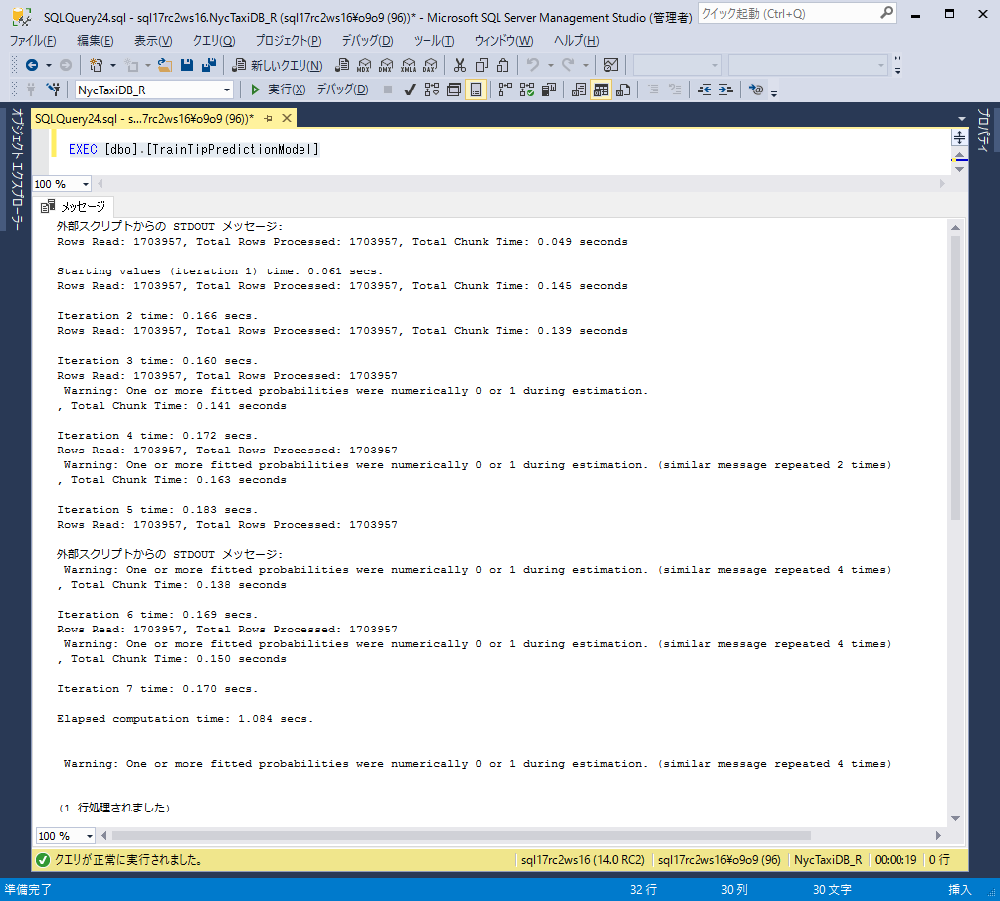
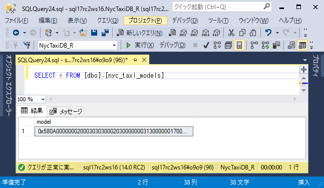

# Lesson 5: T-SQLを使用したモデルのトレーニングと保存

このレッスンでは、Rを使用して機械学習モデルをトレーニングする方法を学習します。作成したデータ特徴を使用してモデルをトレーニングし、訓練されたモデルをSQL Serverのテーブルに保存します。

## 出典
[Lesson 5: Train and save a model using T-SQL](https://docs.microsoft.com/en-us/sql/advanced-analytics/r/sqldev-train-and-save-a-model-using-t-sql)

## モデルのトレーニングのためのストアドプロシージャを作成する

T-SQLからRを呼び出すときは、システムストアドプロシージャsp_execute_external_scriptを使用します。ここではモデルトレーニングを繰り返すことを念頭に、sp_execute_exernal_scriptをカプセル化した別のストアド・プロシージャ`TrainTipPredictionModel`を作成します。

ストアドプロシージャ`TrainTipPredictionModel`は[Lesson 2: PowerShellを使用したSQL Serverへのデータインポート](../r/sqldev-import-data-to-sql-server-using-powershell.md)を通じてSQL Serverに定義されています。

1. Management Studioのオブジェクトエクスプローラで、[プログラミング]、[ストアドプロシージャ]の順に展開します。

2. `TrainTipPredictionModel`を右クリックし、[変更] を選択して新しいクエリウィンドウでTransact-SQLスクリプトを開きます。

    ```SQL:T-SQL
    CREATE PROCEDURE [dbo].[TrainTipPredictionModel]
    
    AS
    BEGIN
      DECLARE @inquery nvarchar(max) = N'
        select tipped, fare_amount, passenger_count,trip_time_in_secs,trip_distance,
        pickup_datetime, dropoff_datetime,
        dbo.fnCalculateDistance(pickup_latitude, pickup_longitude,  dropoff_latitude, dropoff_longitude) as direct_distance
        from nyctaxi_sample
        --tablesample (70 percent) repeatable (98052)
    '
      -- Insert the trained model into a database table
      INSERT INTO nyc_taxi_models
      EXEC sp_execute_external_script @language = N'R',
                                      @script = N'
    
    ## Create model
    logitObj <- rxLogit(tipped ~ passenger_count + trip_distance + trip_time_in_secs + direct_distance, data = InputDataSet)
    summary(logitObj)
    
    ## Serialize model and put it in data frame
    trained_model <- data.frame(model=as.raw(serialize(logitObj, NULL)));
    ',
      @input_data_1 = @inquery,
      @output_data_1_name = N'trained_model'
      ;
    
    END
    GO
    ```
    - SELECTクエリはカスタムスカラ関数`fnCalculateDistance`を使用して、乗車位置と降車位置の間の直接距離を計算します。クエリの結果はデフォルトのR入力変数`InputDataset`に格納されます。
    - Rスクリプトは、R Services (In-Database)に含まれるRevoScaleRライブラリのrxLogit関数を呼び出して、ロジスティック回帰モデルを作成します。tippedをラベル（目的変数）に、passenger_count、trip_distance、trip_time_in_secs、およびdirect_distanceを特徴値列（説明変数）としてモデルを作成します。
    - R変数`logitObj`で示される訓練済みモデルはシリアライズされ出力パラメータとして返ります。この出力をnyc_taxi_modelsテーブルに登録することで、将来の予測に繰り返し使用することができます。

## ストアドプロシージャ`TrainTipPredictionModel`を使用してRモデルを生成する

1. ストアドプロシージャ`TrainTipPredictionModel`を呼び出します。

    ```SQL
    EXEC [dbo].[TrainTipPredictionModel]
    ```
    
    

2. Management Studio のメッセージウィンドウでRの標準出力メッセージを確認してください。

    "STDOUT message(s) from external script: Rows Read: 1703957, Total Rows Processed: 1703957, Total Chunk Time: 0.049 seconds "

    個々の関数に固有のメッセージ `rxLogit`が表示され、モデル作成の一部として生成された変数とテストメトリックが表示されます。

3. ステートメントが完了したら、nyc_taxi_modelsテーブルを開きます。

    テーブルに新しいレコードが1つ追加され、シリアライズされたモデルが登録されていることを確認します。

    

次のステップでは、訓練されたモデルを使用して予測を作成します。

## 次のステップ

[Lesson 6: モデルの利用](../tutorials/sqldev-operationalize-the-model.md)

## 前のステップ

[Lesson 4: T-SQLを使用したデータの特徴抽出](../tutorials/sqldev-create-data-features-using-t-sql.md)

## はじめから

[SQL開発者のための In-Database R 分析](../tutorials/sqldev-in-database-r-for-sql-developers.md)

## 関連項目

[Machine Learning Services with R](https://docs.microsoft.com/en-us/sql/advanced-analytics/r/sql-server-r-services)


<!--
---
title: "Lesson 5: Train and save a model using T-SQL | Microsoft Docs"
ms.custom: ""
ms.date: "07/26/2016"
ms.prod: "sql-server-2016"
ms.reviewer: ""
ms.suite: ""
ms.technology: 
  - "r-services"
ms.tgt_pltfrm: ""
ms.topic: "article"
applies_to: 
  - "SQL Server 2016"
dev_langs: 
  - "R"
  - "TSQL"
ms.assetid: 3282e8ed-b515-4ed5-8543-fcef68629a92
caps.latest.revision: 10
author: "jeannt"
ms.author: "jeannt"
manager: "jhubbard"
---
# Lesson 5: Train and save a model using T-SQL

This article is part of a tutorial for SQL developers on how to use R in SQL Server.

In this lesson, you'll learn how to train a machine learning model by using R. You'll train the model using the data features you just created, and then save the trained model in a [!INCLUDE[ssNoVersion](../../includes/ssnoversion-md.md)] table. In this case, the R packages are already installed with [!INCLUDE[rsql_productname](../../includes/rsql-productname-md.md)], so everything can be done from SQL.

## Create the stored procedure

When calling R from T-SQL, you use the system stored procedure, [sp_execute_external_script](../../relational-databases/system-stored-procedures/sp-execute-external-script-transact-sql.md). However, for processes that you repeat often, such as retraining a model, it is easier to encapsulate the call to  `sp_execute_exernal_script` in another stored procedure.

1.  First, create a stored procedure that contains the R code to build the tip prediction model. In [!INCLUDE[ssManStudio](../../includes/ssmanstudio-md.md)], open a new **Query** window and run the following statement to create the stored procedure _TrainTipPredictionModel_. This stored procedure defines the input data and uses an R package to create a logistic regression model.

    ```SQL
    CREATE PROCEDURE [dbo].[TrainTipPredictionModel]
    
    AS
    BEGIN
      DECLARE @inquery nvarchar(max) = N'
        select tipped, fare_amount, passenger_count,trip_time_in_secs,trip_distance,
        pickup_datetime, dropoff_datetime,
        dbo.fnCalculateDistance(pickup_latitude, pickup_longitude,  dropoff_latitude, dropoff_longitude) as direct_distance
        from nyctaxi_sample
        tablesample (70 percent) repeatable (98052)
    '
      -- Insert the trained model into a database table
      INSERT INTO nyc_taxi_models
      EXEC sp_execute_external_script @language = N'R',
                                      @script = N'
    
    ## Create model
    logitObj <- rxLogit(tipped ~ passenger_count + trip_distance + trip_time_in_secs + direct_distance, data = InputDataSet)
    summary(logitObj)
    
    ## Serialize model and put it in data frame
    trained_model <- data.frame(model=as.raw(serialize(logitObj, NULL)));
    ',
      @input_data_1 = @inquery,
      @output_data_1_name = N'trained_model'
      ;
    
    END
    GO
    ```

    - However, to ensure that some data is left over to test the model, 70% of the data are randomly selected from the taxi data table.
    
    - The SELECT query uses the custom scalar function _fnCalculateDistance_ to calculate the direct distance between the pick-up and drop-off locations.  the results of the query are stored in the default R input variable, `InputDataset`.
  
    - The R script calls the `rxLogit` function, which is one of the enhanced R functions included with [!INCLUDE[rsql_productname](../../includes/rsql-productname-md.md)], to create the logistic regression model.
  
        The binary variable _tipped_ is used as the *label* or outcome column,  and the model is fit using these feature columns:  _passenger_count_, _trip_distance_, _trip_time_in_secs_, and _direct_distance_.
  
    -   The trained model, saved in the R variable `logitObj`, is serialized and put in a data frame for output to [!INCLUDE[ssNoVersion](../../includes/ssnoversion-md.md)]. That output is inserted into the database table _nyc_taxi_models_, so that you can use it for future predictions.
  
2.  Run the statement to create the stored procedure, if it doesn't already exist.

## Generate the R model using the stored procedure

Because the stored procedure already includes a definition of the input data, you don't need to provide an input query.

1. To generate the R model, call the stored procedure without any other parameters:

    ```SQL
    EXEC TrainTipPredictionModel
    ```

2. Watch the **Messages** window of [!INCLUDE[ssManStudio](../../includes/ssmanstudio-md.md)] for messages that would be piped to R's **stdout** stream, like this messaage: 

    "STDOUT message(s) from external script: Rows Read: 1193025, Total Rows Processed: 1193025, Total Chunk Time: 0.093 seconds"

    You might also see messages specific to the individual function, `rxLogit`, displaying the variables and test metrics generated as part of model creation.

3.  When the statement has completed, open the table *nyc_taxi_models*. Processing of the data and fitting the model might take a while.

    You can see that one new row has been added, which contains the serialized model in the column _model_.

    ```
    model
    ------
    0x580A00000002000302020....
    ```

In the next step you'll use the trained model to create predictions.

## Next lesson

[Lesson 6: Operationalize the model](../tutorials/sqldev-operationalize-the-model.md)

## Previous lesson

[Lesson 4: Create data features using T-SQL](..//tutorials/sqldev-create-data-features-using-t-sql.md)

-->