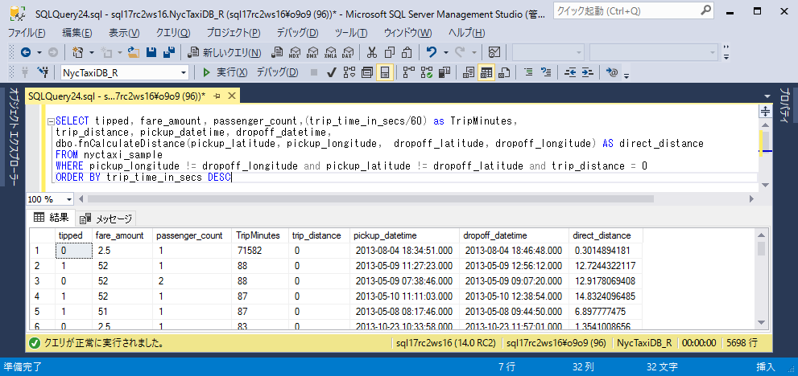

# Lesson 4: T-SQLを使用したデータの特徴抽出

この記事は、SQL開発者のための In-Database R 分析（チュートリアル） の一部です。

このステップでは、Transact-SQL関数を使用して生データから特徴抽出を行う方法を学習します。その後、ストアドプロシージャからその関数を呼び出して、特徴値を含むテーブルを作成します。

## 特徴抽出について

データの探索後、データからいくつかの洞察を収集し特徴エンジニアリングに移ります。生データから特徴抽出を行うプロセスは、高度な分析モデリングの重要なステップです。

元データに記録されたメーター距離値は地理的距離または移動距離を表すものになっていない場合があるため、このデータセットで利用可能な座標を使用して乗車位置と降車位置の間の直接距離を計算します。これを行うためにカスタムTransact-SQL関数で[Haversine式](https://en.wikipedia.org/wiki/Haversine_formula)を使用します。

T-SQL関数`fnCalculateDistance`はHaversine式を使用して距離を計算し、T-SQL関数`fnEngineerFeatures`はすべての特徴を含むテーブルを作成します。

全体の流れは次のとおりです。

- 計算を実行するT-SQL関数を作成する

- 特徴値を生成する関数を呼び出す

- 特徴値をテーブルに保存する

## 関数fnCalculateDistanceを使用して移動距離を計算する

T-SQL関数`fnCalculateDistance`は[Lesson 2: PowerShellを使用したSQL Serverへのデータインポート](../r/sqldev-import-data-to-sql-server-using-powershell.md)を通じてSQL Serverに定義されています。

1. Management Studioのオブジェクトエクスプローラで、[プログラミング]、[関数]、[スカラー値関数]の順に展開します。

2. `fnCalculateDistance`を右クリックし、[変更] を選択して新しいクエリウィンドウでTransact-SQLスクリプトを開きます。

    ```SQL:T-SQL
    CREATE FUNCTION [dbo].[fnCalculateDistance] (@Lat1 float, @Long1 float, @Lat2 float, @Long2 float)  
    -- User-defined function that calculates the direct distance between two geographical coordinates.  
    RETURNS float  
    AS  
    BEGIN  
      DECLARE @distance decimal(28, 10)  
      -- Convert to radians  
      SET @Lat1 = @Lat1 / 57.2958  
      SET @Long1 = @Long1 / 57.2958  
      SET @Lat2 = @Lat2 / 57.2958  
      SET @Long2 = @Long2 / 57.2958  
      -- Calculate distance  
      SET @distance = (SIN(@Lat1) * SIN(@Lat2)) + (COS(@Lat1) * COS(@Lat2) * COS(@Long2 - @Long1))  
      --Convert to miles  
      IF @distance <> 0  
      BEGIN  
        SET @distance = 3958.75 * ATAN(SQRT(1 - POWER(@distance, 2)) / @distance);  
      END  
      RETURN @distance  
    END
    GO
    ```

    - この関数はスカラー値関数であり、事前定義された型の単一のデータ値を返します。
    - 乗車位置と降車位置の場所から得られた緯度と経度の値が入力として使用されます。Haversine式は、位置をラジアンに変換し、これらの値を使用して、2つの場所の間の直接距離を計算します。


## 関数fnEngineerFeaturesを使用して特徴値を保存する

T-SQL関数`fnEngineerFeatures`は[Lesson 2: PowerShellを使用したSQL Serverへのデータインポート](../r/sqldev-import-data-to-sql-server-using-powershell.md)を通じてSQL Serverに定義されています。

`fnEngineerFeatures`は複数の列を入力として使用し複数の特徴値列を返すテーブル値関数です。`fnEngineerFeatures`の目的は、モデル構築に使用する特徴値セットを作成することです。`fnEngineerFeatures`は乗車位置と降車位置の間の直線距離を得るために`fnCalculateDistance`を呼び出します。

1. Management Studioのオブジェクトエクスプローラで、[プログラミング]、[関数]、[スカラー値関数]の順に展開し、`fnEngineerFeatures`を右クリックし、[変更] を選択して新しいクエリウィンドウでTransact-SQLスクリプトを開きます。

    ```SQL:T-SQL
    CREATE FUNCTION [dbo].[fnEngineerFeatures] (  
    @passenger_count int = 0,  
    @trip_distance float = 0,  
    @trip_time_in_secs int = 0,  
    @pickup_latitude float = 0,  
    @pickup_longitude float = 0,  
    @dropoff_latitude float = 0,  
    @dropoff_longitude float = 0)  
    RETURNS TABLE  
    AS
      RETURN
      (
      -- Add the SELECT statement with parameter references here
      SELECT
        @passenger_count AS passenger_count,
        @trip_distance AS trip_distance,
        @trip_time_in_secs AS trip_time_in_secs,
        [dbo].[fnCalculateDistance](@pickup_latitude, @pickup_longitude, @dropoff_latitude, @dropoff_longitude) AS direct_distance
  
      )
    GO
    ```

    + このテーブル値関数は、複数の列を入力し、複数の特徴値の列を含むテーブルを出力する。
    + この関数の目的は、モデルを構築するための新しい特徴値を作成することです。

2.  これが機能することを確認するために、乗車位置と降車位置の場所が異なる運転にもかかわらずメーター距離値が0に設定された記録に対して地理的距離を計算してみます。

    ```SQL:T-SQL
    SELECT tipped, fare_amount, passenger_count,(trip_time_in_secs/60) as TripMinutes,
    trip_distance, pickup_datetime, dropoff_datetime,
    dbo.fnCalculateDistance(pickup_latitude, pickup_longitude,  dropoff_latitude, dropoff_longitude) AS direct_distance
    FROM nyctaxi_sample
    WHERE pickup_longitude != dropoff_longitude and pickup_latitude != dropoff_latitude and trip_distance = 0
    ORDER BY trip_time_in_secs DESC
    ```
    
    
    
    この通りメーターによって報告された距離は、必ずしも地理的距離を示すものとして記録されているとは限りません。こうした前処理が特徴エンジニアリングが重要な理由です。

次のステップでは、これらの機能を使用して、Rを使用して機械学習モデルを作成し、トレーニングする方法を学習します。

## 次のステップ

[Lesson 5: T-SQLを使用したモデルのトレーニングと保存](../r/sqldev-train-and-save-a-model-using-t-sql.md)

## 前のステップ

[Lesson 3: データの探索と可視化](../tutorials/sqldev-explore-and-visualize-the-data.md)

## はじめから

[SQL開発者のための In-Database R 分析](../tutorials/sqldev-in-database-r-for-sql-developers.md)

## 関連項目

[Machine Learning Services with R](https://docs.microsoft.com/en-us/sql/advanced-analytics/r/sql-server-r-services)


<!--
---
title: "Lesson 4: Create data features using T-SQL  | Microsoft Docs"
ms.custom: ""
ms.date: "07/26/2016"
ms.prod: "sql-server-2016"
ms.reviewer: ""
ms.suite: ""
ms.technology: 
  - "r-services"
ms.tgt_pltfrm: ""
ms.topic: "article"
applies_to: 
  - "SQL Server 2016"
dev_langs: 
  - "R"
  - "TSQL"
ms.assetid: 5b2f4c44-6192-40df-abf1-fc983844f1d0
caps.latest.revision: 10
author: "jeannt"
ms.author: "jeannt"
manager: "jhubbard"
---
# Lesson 4: Create data features using T-SQL

This article is part of a tutorial for SQL developers on how to use R in SQL Server.

In this step, you'll learn how to create features from raw data by using a [!INCLUDE[tsql](../../includes/tsql-md.md)] function. You'll then call that function from a stored procedure to create a table that contains the feature values.

## About feature engineering

After several rounds of data exploration, you have collected some insights from the data, and are ready to move on to *feature engineering*. This process of creating meaningful features from the raw data is a critical step in creating analytical models.

In this dataset, the distance values are based on the reported meter distance, and don't necessarily represent geographical distance or the actual distance traveled. Therefore, you'll need to calculate the direct distance between the pick-up and drop-off points, by using the coordinates available in the source NYC Taxi dataset. You can do this by using the [Haversine formula](https://en.wikipedia.org/wiki/Haversine_formula) in a custom [!INCLUDE[tsql](../../includes/tsql-md.md)] function.

You'll use one custom T-SQL function, _fnCalculateDistance_, to compute the distance using the Haversine formula, and use a second custom T-SQL function, _fnEngineerFeatures_, to create a table containing all the features.

The overall process is as follows:

- Create the T-SQL function that performs the calculations

- Call the function to generate the feature data

- Save the feature data to a table

## Calculate trip distance using fnCalculateDistance

The function _fnCalculateDistance_ should have been downloaded and registered with [!INCLUDE[ssNoVersion](../../includes/ssnoversion-md.md)] as part of the preparation for this tutorial. Take a minute to review the code.
  
1. In [!INCLUDE[ssManStudio](../../includes/ssmanstudio-md.md)], expand **Programmability**, expand **Functions** and then **Scalar-valued functions**.   

2. Right-click _fnCalculateDistance_, and select **Modify** to open the [!INCLUDE[tsql](../../includes/tsql-md.md)] script in a new query window.
  
    ```SQL
    CREATE FUNCTION [dbo].[fnCalculateDistance] (@Lat1 float, @Long1 float, @Lat2 float, @Long2 float)  
    -- User-defined function that calculates the direct distance between two geographical coordinates.  
    RETURNS float  
    AS  
    BEGIN  
      DECLARE @distance decimal(28, 10)  
      -- Convert to radians  
      SET @Lat1 = @Lat1 / 57.2958  
      SET @Long1 = @Long1 / 57.2958  
      SET @Lat2 = @Lat2 / 57.2958  
      SET @Long2 = @Long2 / 57.2958  
      -- Calculate distance  
      SET @distance = (SIN(@Lat1) * SIN(@Lat2)) + (COS(@Lat1) * COS(@Lat2) * COS(@Long2 - @Long1))  
      --Convert to miles  
      IF @distance <> 0  
      BEGIN  
        SET @distance = 3958.75 * ATAN(SQRT(1 - POWER(@distance, 2)) / @distance);  
      END  
      RETURN @distance  
    END
    GO
    ```
  
    - The function is a scalar-valued function, returning a single data value of a predefined type.
  
    - It takes latitude and longitude values as inputs, obtained from trip pick-up and drop-off locations. The Haversine formula converts locations to radians and uses those values to compute the direct distance in miles between those two locations.

## Generate the features using _fnEngineerFeatures_

To add the computed values to a table that can be used for training the model, you'll use another function, _fnEngineerFeatures_. The new function calls the previously created T-SQL function, _fnCalculateDistance_, to get the direct distance between pick-up and drop-off locations. 

1. Take a minute to review the code for the custom T-SQL function, _fnEngineerFeatures_, which should have been created for you as part of the preparation for this walkthrough.
  
    ```SQL
    CREATE FUNCTION [dbo].[fnEngineerFeatures] (  
    @passenger_count int = 0,  
    @trip_distance float = 0,  
    @trip_time_in_secs int = 0,  
    @pickup_latitude float = 0,  
    @pickup_longitude float = 0,  
    @dropoff_latitude float = 0,  
    @dropoff_longitude float = 0)  
    RETURNS TABLE  
    AS
      RETURN
      (
      -- Add the SELECT statement with parameter references here
      SELECT
        @passenger_count AS passenger_count,
        @trip_distance AS trip_distance,
        @trip_time_in_secs AS trip_time_in_secs,
        [dbo].[fnCalculateDistance](@pickup_latitude, @pickup_longitude, @dropoff_latitude, @dropoff_longitude) AS direct_distance
  
      )
    GO
    ```

    + This table-valued function that takes multiple columns as inputs, and outputs a table with multiple feature columns.

    + The purpose of this function is to create new features for use in building a model.

2.  To verify that this function works, use it to calculate the geographical distance for those trips where the metered distance was 0 but the pick-up and drop-off locations were different.
  
    ```SQL
        SELECT tipped, fare_amount, passenger_count,(trip_time_in_secs/60) as TripMinutes,
        trip_distance, pickup_datetime, dropoff_datetime,
        dbo.fnCalculateDistance(pickup_latitude, pickup_longitude,  dropoff_latitude, dropoff_longitude) AS direct_distance
        FROM nyctaxi_sample
        WHERE pickup_longitude != dropoff_longitude and pickup_latitude != dropoff_latitude and trip_distance = 0
        ORDER BY trip_time_in_secs DESC
    ```
  
    As you can see, the distance reported by the meter doesn't always correspond to geographical distance. This is why feature engineering is so important. You can use these improved data features to train a machine learning model using R.

## Next lesson

[Lesson 5: Train and save a model using T-SQL](../r/sqldev-train-and-save-a-model-using-t-sql.md)

## Previous lesson

[Lesson 3: Explore and visualize the data](../tutorials/sqldev-explore-and-visualize-the-data.md)
-->