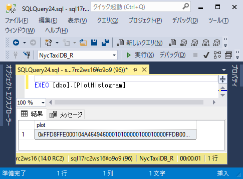
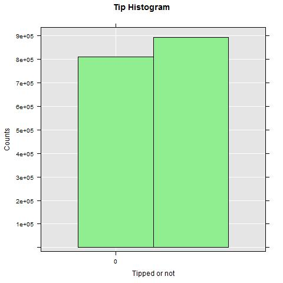
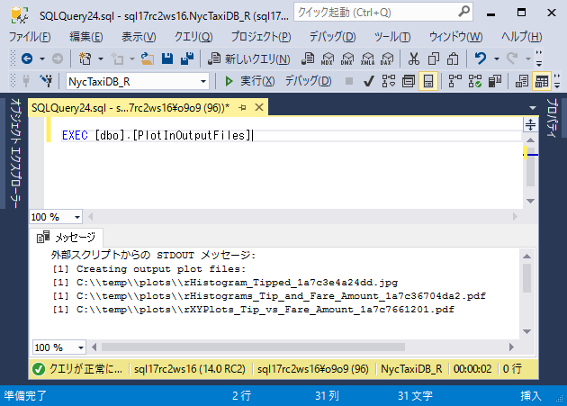
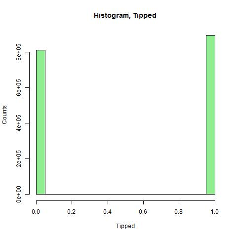
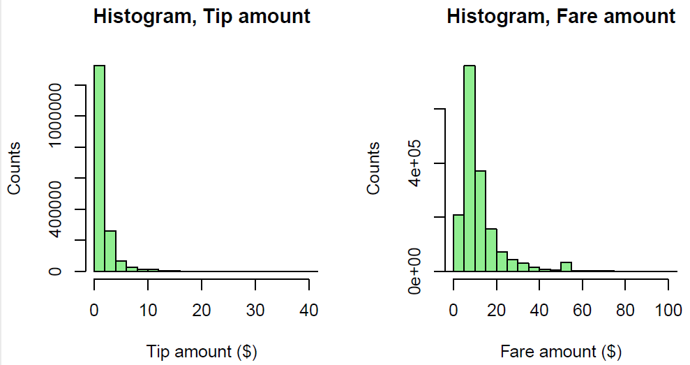
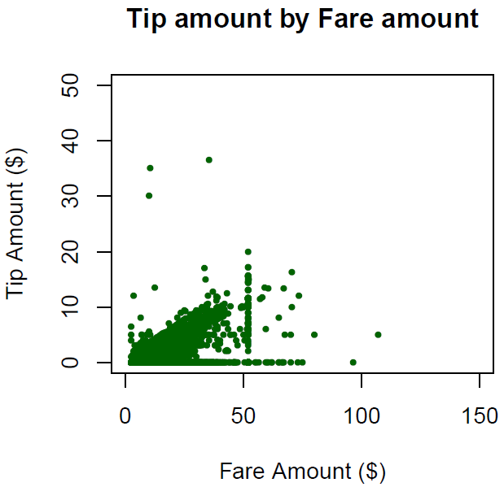

# Lesson 3: データの探索と可視化

このレッスンでは、サンプルデータを探索しR関数を使用していくつかのプロットを生成します。これらのR関数は、すでにRサービス（データベース内）に含まれています。 Transact-SQLからR関数を呼び出すことができます。

## データの確認

データサイエンスソリューション開発には、通常、集中的なデータの探索とデータの可視化が含まれます。まずサンプルデータを確認してください。

元のデータセットにはタクシー識別子と運転記録が別々のファイルで提供されていますが、サンプルデータを使いやすくするためにmedallion、hack_license、pickup_datetimeをキーにジョインしています。また使用するレコードは、元のレコード数の1％でサンプリングしています。サンプリングされたデータセットは1,703,957の行と23の列を持っています。

**タクシー識別子**

- medallion列はタクシーの一意なID番号を示します。
- hack_license列は運転手の匿名化された運転免許証番号を示します。

**運転記録および運賃記録**

- 各運転記録には、乗車と降車の場所と時間、および運転距離が含まれます。
- 各運賃記録には、支払タイプ、合計支払い額、チップ金額などの支払情報が含まれます。
- 最後の3つの列は、さまざまな機械学習タスクに使用できます。
    - tip_amount列は連続した数値が含まれ、回帰分析のためのラベル列（目的変数）として使用できます。
    - tipped列は yes / no 値のみがあり、二項分類のためのラベル列（目的変数）として使用できます。
    - tip_class列は複数の**クラスラベル**があり、多項分類のためのラベル列（目的変数）として使用できます。

- ラベル列（目的変数）として使用される値はtip_amount列に基づいています。
  
    |列|ルール|
    |-|-|
     |tipped|If tip_amount > 0, tipped = 1, otherwise tipped = 0|
    |tip_class|Class 0: tip_amount = $0<br /><br />Class 1: tip_amount > $0 and tip_amount <= $5<br /><br />Class 2: tip_amount > $5 and tip_amount <= $10<br /><br />Class 3: tip_amount > $10 and tip_amount <= $20<br /><br />Class 4: tip_amount > $20|

## T-SQL内のRでプロットを作成する

可視化はデータと異常値の分布を理解するために重要で、Rにはデータ可視化のための多くのパッケージが提供されています。Rの標準ディストリビューションは、ヒストグラム、散布図、箱ひげ図、およびその他のデータ探索グラフを作成するための多くの機能を含む人気のライブラリです。

Rは典型的に画像出力用のRデバイスを用いて画像を生成します。このデバイスの出力をキャプチャして、アプリケーションをvarbinaryデータ型で保存してアプリケーションでレンダリングするか、サポートファイル形式（.JPG、.PDFなど）に保存できます。

このセクションでは、ストアドプロシージャを使用して各タイプの出力を操作する方法を学習します。全体の流れは次のとおりです。

- varbinaryデータとしてRプロットを生成するストアドプロシージャを作成する

- プロットを生成して画像ファイルに保存する

- ストアドプロシージャを使用してバイナリプロットデータをJPGまたはPDFファイルに変換する

## ストアドプロシージャPlotHistogramを作成する

ストアドプロシージャ`PlotHistogram`は[Lesson 2: PowerShellを使用したSQL Serverへのデータインポート](../r/sqldev-import-data-to-sql-server-using-powershell.md)を通じてSQL Serverに定義されています。

1. Management Studioのオブジェクトエクスプローラで、[プログラミング]、[ストアドプロシージャ]の順に展開します。

2. `PlotHistogram`を右クリックし、[変更] を選択して新しいクエリウィンドウでTransact-SQLスクリプトを開きます。
    
    ```SQL:T-SQL
    CREATE PROCEDURE [dbo].[PlotHistogram]
    AS
    BEGIN
      SET NOCOUNT ON;
      DECLARE @query nvarchar(max) =  
      N'SELECT tipped FROM nyctaxi_sample'  
      EXECUTE sp_execute_external_script @language = N'R',  
                                         @script = N'  
       image_file = tempfile();  
       jpeg(filename = image_file);  
       #Plot histogram  
       rxHistogram(~tipped, data=InputDataSet, col=''lightgreen'',   
       title = ''Tip Histogram'', xlab =''Tipped or not'', ylab =''Counts'');  
       dev.off();  
       OutputDataSet <- data.frame(data=readBin(file(image_file, "rb"), what=raw(), n=1e6));  
       ',  
       @input_data_1 = @query  
       WITH RESULT SETS ((plot varbinary(max)));  
    END
    GO
    ```

    - 変数 `@query`は、スクリプト入力変数`@input_data_1`への引数としてRスクリプトに渡されるクエリテキスト(`'SELECT tipped FROM nyctaxi_sample'`)を定義    します。
    - Rスクリプトはかなり簡単です。R変数(`image_file`)がイメージを格納するように定義されていて、次に`rxHistogram`関数が呼び出されてプロットが生成され    ます。
    - Rデバイスは**off**に設定されます。
      Rではハイレベルのプロットコマンドを発行すると、*device*と呼ばれるグラフィックスウィンドウが開きます。ウィンドウのサイズや色などを変更することができます。また、ファイルへの書き込みや別の方法で出力したい場合はデバイスをオフにすることができます。
    - Rグラフィックスオブジェクトは、出力のためにR data.frameにシリアル化されます。

## 画像ファイルを生成しファイルに保存します

ストアドプロシージャは、画像をvarbinaryデータのストリームとして返します。これは明らかに直接表示できません。 ただし、**bcp**ユーティリティを使用してvarbinaryデータを取得し、クライアントコンピュータにイメージファイルとして保存することができます。

2.  Management Studioで以下のクエリを実行します。
  
    ```SQL:T-SQL
    EXEC [dbo].[PlotHistogram]
    ```
  
    

3.  コマンドプロンプトを使用し、適切なインスタンス名、データベース名、ユーザー名、資格情報を指定して次のコマンドを実行します。
  
     ```CMD
     bcp "exec PlotHistogram" queryout "plot.jpg" -S <SQL Server instance name> -d <database name> -U <user name> -P <password>
     ```

    > [!NOTE]
    > bcpのコマンドスイッチでは大文字と小文字が区別されます。

4.  接続に成功すると、画像ファイルに関する詳細情報の入力が求められます。次の変更を除きENTERで進みます。
  
    - **prefix-length of field plot**に0を入力します。
  
    - フォーマットファイルを保存する場合は、**Y**を入力します。
    
    
    
    > [!TIP]
    > フォーマットファイル（bcp.fmt）の保存を指定すると**bcp**ユーティリティはフォーマット定義を生成します。このフォーマット定義は、将来画像ファイルフォーマットオプションを要求されることなく同様のコマンドに適用できます。 書式ファイルを使用するには、コマンドラインに `-f bcp.fmt`を追加します。

5.  出力ファイル（plot.jpg）は、コマンドを実行したディレクトリに作成されます。
  
    
  
## 表示可能なファイルにプロットデータをエクスポートします。

Rプロットをバイナリデータ型に出力することは、アプリケーションでの使用には便利ですが、データ探索段階でレンダリングされたプロットを必要とするデータ分析者にとってはあまり役に立ちません。一般的にデータ分析者は様々な視点からデータへの洞察を得るために、複数のデータ視覚化を生成します。

ユーザーのグラフを生成するには、.JPG、.PDF、.PNGなどの一般的な形式でRの出力を作成するストアドプロシージャを使用できます。ストアドプロシージャが画像を作成したら、画像ファイルを開いてプロットを確認します。

1. ヒストグラム、散布図、およびその他のR画像ファイルを.JPGおよび.PDF形式に書き込むストアドプロシージャ`PlotInOutputFiles`を作成します。

    `PlotInOutputFiles`は[Lesson 2: PowerShellを使用したSQL Serverへのデータインポート](../r/sqldev-import-data-to-sql-server-using-powershell.md)を通じてSQL Serverに定義されています。
    
    Management Studioのオブジェクトエクスプローラで、[プログラミング]、[ストアドプロシージャ]の順に展開します。`PlotInOutputFiles`を右クリックし、[変更] を選択して新しいクエリウィンドウでTransact-SQLスクリプトを開きます。

    ```SQL:T-SQL
    CREATE PROCEDURE [dbo].[PlotInOutputFiles]  
    AS  
    BEGIN  
      SET NOCOUNT ON;  
      DECLARE @query nvarchar(max) =  
      N'SELECT cast(tipped as int) as tipped, tip_amount, fare_amount FROM [dbo].[nyctaxi_sample]'  
      EXECUTE sp_execute_external_script @language = N'R',  
      @script = N'  
       # Set output directory for files and check for existing files with same names   
        mainDir <- ''C:\\temp\\plots''  
        dir.create(mainDir, recursive = TRUE, showWarnings = FALSE)  
        setwd(mainDir);  
        print("Creating output plot files:", quote=FALSE)
        
        # Open a jpeg file and output histogram of tipped variable in that file.  
        dest_filename = tempfile(pattern = ''rHistogram_Tipped_'', tmpdir = mainDir)  
        dest_filename = paste(dest_filename, ''.jpg'',sep="")  
        print(dest_filename, quote=FALSE);  
        jpeg(filename=dest_filename);  
        hist(InputDataSet$tipped, col = ''lightgreen'', xlab=''Tipped'',   
            ylab = ''Counts'', main = ''Histogram, Tipped'');  
         dev.off();  

        # Open a pdf file and output histograms of tip amount and fare amount.   
        # Outputs two plots in one row  
        dest_filename = tempfile(pattern = ''rHistograms_Tip_and_Fare_Amount_'', tmpdir = mainDir)  
        dest_filename = paste(dest_filename, ''.pdf'',sep="")  
        print(dest_filename, quote=FALSE);  
        pdf(file=dest_filename, height=4, width=7);  
        par(mfrow=c(1,2));  
        hist(InputDataSet$tip_amount, col = ''lightgreen'',   
            xlab=''Tip amount ($)'',   
            ylab = ''Counts'',   
            main = ''Histogram, Tip amount'', xlim = c(0,40), 100);  
        hist(InputDataSet$fare_amount, col = ''lightgreen'',   
            xlab=''Fare amount ($)'',   
            ylab = ''Counts'',   
            main = ''Histogram,   
            Fare amount'',   
            xlim = c(0,100), 100);  
       dev.off();  
  
        # Open a pdf file and output an xyplot of tip amount vs. fare amount using lattice;  
        # Only 10,000 sampled observations are plotted here, otherwise file is large.  
        dest_filename = tempfile(pattern = ''rXYPlots_Tip_vs_Fare_Amount_'', tmpdir = mainDir)  
        dest_filename = paste(dest_filename, ''.pdf'',sep="")  
        print(dest_filename, quote=FALSE);  
        pdf(file=dest_filename, height=4, width=4);  
        plot(tip_amount ~ fare_amount,   
            data = InputDataSet[sample(nrow(InputDataSet), 10000), ],   
            ylim = c(0,50),   
            xlim = c(0,150),   
            cex=.5,   
            pch=19,   
            col=''darkgreen'',    
            main = ''Tip amount by Fare amount'',   
            xlab=''Fare Amount ($)'',   
            ylab = ''Tip Amount ($)'');   
        dev.off();',  
     @input_data_1 = @query  
     END
    ```

    -   ストアドプロシージャ内のSELECTクエリの出力は、デフォルトのRデータフレーム、 `InputDataSet`に格納されます。 様々なRプロット関数を呼び出して、実際の画像ファイルを生成することができます。
  
        組み込まれたRスクリプトのほとんどは `plot`や` hist`のようなグラフィック関数のオプションを表します。
  
    -   すべてのファイルはローカルフォルダ_C:\temp\Plots\\_に保存されます。 コピー先フォルダは、ストアドプロシージャの一部としてRスクリプトに提供される引数によって定義されます。 変数 `mainDir`の値を変更することで、保存先フォルダを変更することができます。

2.  Management Studio で以下のクエリを実行します。

    ```SQL:T-SQL
    EXEC [dbo].[PlotInOutputFiles]
    ```

    
    
    ファイル名の数字はランダムに生成され、既存のファイルに書き込むときにエラーが発生しないようにしています。

3. プロットを表示するには、保存先フォルダを開き、ストアドプロシージャのRコードによって作成されたファイルを確認します。

    + `rHistogram_Tipped.jpg`ファイルには、ヒントがある旅行の数とヒントがない旅行の数が表示されます。 （このヒストグラムは、前の手順で生成したヒストグラムによく似ています）。

    

    + `rHistograms_Tip_and_Fare_Amount.pdf`ファイルは、料金の金額に対してプロットされたチップ金額の分布を示しています。
    
    

    + `rXYPlots_Tip_vs_Fare_Amount.pdf`ファイルは、x軸上に料金、y軸上にチップ金額とした散布図です。

    

4.  ファイルを別のフォルダに出力するには、ストアドプロシージャに埋め込まれたRスクリプトの `mainDir`変数の値を変更します。 スクリプトを変更して、異なる形式やファイルなどを出力することもできます。

## 次のステップ

[Lesson 4: T-SQLを使用したデータの特徴抽出](../tutorials/sqldev-create-data-features-using-t-sql.md)

## 前のステップ

[Lesson 2: PowerShellを使用したSQL Serverへのデータインポート](../r/sqldev-import-data-to-sql-server-using-powershell.md)

## はじめから

[SQL開発者のための In-Database R 分析](../tutorials/sqldev-in-database-r-for-sql-developers.md)

## 関連項目

[Machine Learning Services with R](https://docs.microsoft.com/en-us/sql/advanced-analytics/r/sql-server-r-services)


<!--
---
title: "Lesson 3: Explore and visualize the data | Microsoft Docs"
ms.custom: ""
ms.date: "07/26/2017"
ms.prod: "sql-server-2016"
ms.reviewer: ""
ms.suite: ""
ms.technology: 
  - "r-services"
ms.tgt_pltfrm: ""
ms.topic: "article"
applies_to: 
  - "SQL Server 2016"
dev_langs: 
  - "R"
  - "TSQL"
ms.assetid: 7fe670f3-5e62-43ef-97eb-b9af54df9128
caps.latest.revision: 11
author: "jeannt"
ms.author: "jeannt"
manager: "jhubbard"
---
# Lesson 3: Explore and visualize the data

This article is part of a tutorial for SQL developers on how to use R in SQL Server.

In this lesson, you'll review the sample data, and then generate some plots using R functions. These R functions are already included in [!INCLUDE[rsql_productname](../../includes/rsql-productname-md.md)]. You can call the R functions from [!INCLUDE[tsql](../../includes/tsql-md.md)].

## Review the data

Developing a data science solution usually includes intensive data exploration and data visualization. So first take a minute to review the sample data, if you haven't already.

In the original dataset, the taxi identifiers and trip records were provided in separate files. However, to make the sample data easier to use, the two original datasets have been joined on the columns _medallion_, _hack\_license_, and _pickup\_datetime_.  The records were also sampled to get just 1% of the original number of records. The resulting down-sampled dataset has 1,703,957 rows and 23 columns.

**Taxi identifiers**
  
-   The _medallion_ column represents the taxi’s unique id number.
  
-   The _hack\_license_ column contains the taxi driver's license number (anonymized).
  
**Trip and fare records**
  
-   Each trip record includes the pickup and drop-off location and time, and the trip distance.
  
-   Each fare record includes payment information such as the payment type, total amount of payment, and the tip amount.
  
-   The last three columns can be used for various machine learning tasks.  The _tip\_amount_ column contains continuous numeric values and can be used as the **label** column for regression analysis. The _tipped_ column has only yes/no values and is used for binary classification. The _tip\_class_ column has multiple **class labels** and therefore can be used as the label for multi-class classification tasks.
  
    This walkthrough demonstrates only the binary classification task; you are welcome to try building models for the other two machine learning tasks, regression and multiclass classification.
  
-   The values used for the label columns are all based on the _tip\_amount_ column, using these business rules:
  
    |Derived column name|Rule|
    |-|-|
     |tipped|If tip_amount > 0, tipped = 1, otherwise tipped = 0|
    |tip_class|Class 0: tip_amount = $0<br /><br />Class 1: tip_amount > $0 and tip_amount <= $5<br /><br />Class 2: tip_amount > $5 and tip_amount <= $10<br /><br />Class 3: tip_amount > $10 and tip_amount <= $20<br /><br />Class 4: tip_amount > $20|

## Create plots using R in T-SQL

Because visualization is such a powerful tool for understanding the distribution of the data and outliers, R provides many packages for visualizing data. The standard open-source distribution of R also includes many functions for crating histograms, scatter plots, box plots,  and other data exploration graphs.

R typically creates images using an R device for graphical output. You can capture the output of this device and store the image in a **varbinary** data type for rendering in application, or you can save the images to any of the support file formats (.JPG, .PDF, etc.).

In this section, you'll learn how to work with each type of output using stored procedures. The overall process is as follows:

- Create a stored procedure to generate an R plot as varbinary data

- Generate the plot and save it to an image file

- Use a stored procedure to convert the binary plot data to a JPG or PDF file

### Create the stored procedure PlotHistogram

1. To create the plot, use `rxHistogram`, one of the enhanced R functions provided in [!INCLUDE[rsql_productname](../../includes/rsql-productname-md.md)], to plot a histogram based on data from a [!INCLUDE[tsql](../../includes/tsql-md.md)] query. To make it easier to call the R function, you will wrap it in a stored procedure, _PlotHistogram_.

    In [!INCLUDE[ssManStudioFull](../../includes/ssmanstudiofull-md.md)], open a new **Query** window.

2. In the database that contains the tutorial data, create the procedure using this statement:

    ```SQL
    CREATE PROCEDURE [dbo].[PlotHistogram]
    AS
    BEGIN
      SET NOCOUNT ON;
      DECLARE @query nvarchar(max) =  
      N'SELECT tipped FROM nyctaxi_sample'  
      EXECUTE sp_execute_external_script @language = N'R',  
                                         @script = N'  
       image_file = tempfile();  
       jpeg(filename = image_file);  
       #Plot histogram  
       rxHistogram(~tipped, data=InputDataSet, col=''lightgreen'',   
       title = ''Tip Histogram'', xlab =''Tipped or not'', ylab =''Counts'');  
       dev.off();  
       OutputDataSet <- data.frame(data=readBin(file(image_file, "rb"), what=raw(), n=1e6));  
       ',  
       @input_data_1 = @query  
       WITH RESULT SETS ((plot varbinary(max)));  
    END
    GO
    ```

    Be sure to modify the code to use the correct table name, if needed.
  
    -   The variable `@query` defines the query text (`'SELECT tipped FROM nyctaxi_sample'`), which is passed to the R script as the argument to the script input variable, `@input_data_1`.
  
    -   The R script is fairly simple: an R variable (`image_file`) is defined to store the image, and then the `rxHistogram` function is called to generate the plot.
  
    -   The R device is set to **off**.
  
        In R, when you issue a high-level plotting command, R will open a graphics window, called a *device*. You can change the size and colors and other aspects of the window, or you can turn the device off if you are writing to a file or handling the output some other way.
  
    -   The R graphics object is serialized to an R data.frame for output.

### Generate the graphics data and save to file

The stored procedure returns the image as a stream of varbinary data, which obviously you cannot view directly. However, you can use the **bcp** utility to get the varbinary data and save it as an image file on a client computer.
  
1.  In [!INCLUDE[ssManStudio](../../includes/ssmanstudio-md.md)], run the following statement:
  
    ```SQL
    EXEC [dbo].[PlotHistogram]
    ```
  
    **Results**
    
    *plot*
    *0xFFD8FFE000104A4649...*
  
2.  Open a PowerShell command prompt and run the following command, providing the appropriate instance name, database name, username, and credentials as arguments:
  
     ```
     bcp "exec PlotHistogram" queryout "plot.jpg" -S <SQL Server instance name> -d  <database name>  -U <user name> -P <password>
     ```

    > [!NOTE]
    > Command switches for bcp are case-sensitive.
  
3.  If the connection is successful, you will be prompted to enter more information about the graphic file format. Press ENTER at each prompt to accept the defaults, except for these changes:
  
    -   For **prefix-length of field plot**, type 0
  
    -   Type **Y** if you want to save the output parameters for later reuse.
  
    ```
    Enter the file storage type of field plot [varbinary(max)]:
    Enter prefix-length of field plot [8]: 0
    Enter length of field plot [0]:
    Enter field terminator [none]:
  
    Do you want to save this format information in a file? [Y/n]
    Host filename [bcp.fmt]:
    ```
  
    **Results**
    
    ```
    Starting copy...
    1 rows copied.
    Network packet size (bytes): 4096
    Clock Time (ms.) Total     : 3922   Average : (0.25 rows per sec.)
    ```

    > [!TIP]
    > If you save the format information to file (bcp.fmt), the **bcp** utility generates a format definition that you can apply to similar commands in future without being prompted for graphic file format options. To use the format file, add `-f bcp.fmt` to the end of any command line, after the password argument.
  
4.  The output file will be created in the same directory where you ran the PowerShell command. To view the plot, just open the file plot.jpg.
  
      
  
### Export the plot data to a viewable file

Outputting an R plot to a binary data type might be convenient for consumption by applications, but it is not very useful to a data scientist who needs the rendered plot during the data exploration stage. Typically the data scientist will generate multiple data visualizations, to get insights into the data from different perspectives.

To generate graphs for users, you can use a stored procedure that creates the output of R in popular formats such as .JPG, .PDF, and .PNG. After the stored procedure creates the graphic, simply open the file to visualize the plot.

1. Create a new stored procedure, _PlotInOutputFiles_, that demonstrates how to write histograms, scatterplots, and other R graphics to .JPG and .PDF format.

    In [!INCLUDE[ssManStudioFull](../../includes/ssmanstudiofull-md.md)], open a new **Query** window, and paste in the following [!INCLUDE[tsql](../../includes/tsql-md.md)] statement.
  
    ```SQL
    CREATE PROCEDURE [dbo].[PlotInOutputFiles]  
    AS  
    BEGIN  
      SET NOCOUNT ON;  
      DECLARE @query nvarchar(max) =  
      N'SELECT cast(tipped as int) as tipped, tip_amount, fare_amount FROM [dbo].[nyctaxi_sample]'  
      EXECUTE sp_execute_external_script @language = N'R',  
      @script = N'  
       # Set output directory for files and check for existing files with same names   
        mainDir <- ''C:\\temp\\plots''  
        dir.create(mainDir, recursive = TRUE, showWarnings = FALSE)  
        setwd(mainDir);  
        print("Creating output plot files:", quote=FALSE)
        
        # Open a jpeg file and output histogram of tipped variable in that file.  
        dest_filename = tempfile(pattern = ''rHistogram_Tipped_'', tmpdir = mainDir)  
        dest_filename = paste(dest_filename, ''.jpg'',sep="")  
        print(dest_filename, quote=FALSE);  
        jpeg(filename=dest_filename);  
        hist(InputDataSet$tipped, col = ''lightgreen'', xlab=''Tipped'',   
            ylab = ''Counts'', main = ''Histogram, Tipped'');  
         dev.off();  

        # Open a pdf file and output histograms of tip amount and fare amount.   
        # Outputs two plots in one row  
        dest_filename = tempfile(pattern = ''rHistograms_Tip_and_Fare_Amount_'', tmpdir = mainDir)  
        dest_filename = paste(dest_filename, ''.pdf'',sep="")  
        print(dest_filename, quote=FALSE);  
        pdf(file=dest_filename, height=4, width=7);  
        par(mfrow=c(1,2));  
        hist(InputDataSet$tip_amount, col = ''lightgreen'',   
            xlab=''Tip amount ($)'',   
            ylab = ''Counts'',   
            main = ''Histogram, Tip amount'', xlim = c(0,40), 100);  
        hist(InputDataSet$fare_amount, col = ''lightgreen'',   
            xlab=''Fare amount ($)'',   
            ylab = ''Counts'',   
            main = ''Histogram,   
            Fare amount'',   
            xlim = c(0,100), 100);  
       dev.off();  
  
        # Open a pdf file and output an xyplot of tip amount vs. fare amount using lattice;  
        # Only 10,000 sampled observations are plotted here, otherwise file is large.  
        dest_filename = tempfile(pattern = ''rXYPlots_Tip_vs_Fare_Amount_'', tmpdir = mainDir)  
        dest_filename = paste(dest_filename, ''.pdf'',sep="")  
        print(dest_filename, quote=FALSE);  
        pdf(file=dest_filename, height=4, width=4);  
        plot(tip_amount ~ fare_amount,   
            data = InputDataSet[sample(nrow(InputDataSet), 10000), ],   
            ylim = c(0,50),   
            xlim = c(0,150),   
            cex=.5,   
            pch=19,   
            col=''darkgreen'',    
            main = ''Tip amount by Fare amount'',   
            xlab=''Fare Amount ($)'',   
            ylab = ''Tip Amount ($)'');   
        dev.off();',  
     @input_data_1 = @query  
     END
    ```
  
    -   The output of the SELECT query within the stored procedure is stored in the default R data frame, `InputDataSet`. Various R plotting functions can then be called to generate the actual graphics files.
  
        Most of the embedded R script represents options for these graphics functions,  such as `plot` or `hist`.
  
    -   All files are saved to the local folder _C:\temp\Plots\\_. The destination folder is defined by the arguments provided to the R script as part of the stored procedure.  You can change the destination folder by changing the value of the variable, `mainDir`.
  
2.  Run the statement to create the stored procedure.

    ```SQL
    EXEC PlotInOutputFiles
    ```

    **Results**
    
    ```
    STDOUT message(s) from external script:
    [1] Creating output plot files:[1] C:\temp\plots\rHistogram_Tipped_18887f6265d4.jpg[1] 
    
    C:\temp\plots\rHistograms_Tip_and_Fare_Amount_1888441e542c.pdf[1]
    
    C:\temp\plots\rXYPlots_Tip_vs_Fare_Amount_18887c9d517b.pdf
    ```

    The numbers in the file names are randomly generated to ensure that you don't get an error when trying to write to an existing file.

3. To view the plot, open the destination folder and review the files that were created by the R code in the stored procedure.

    + The file `rHistogram_Tipped.jpg` shows the number of trips that got a tip vs. the trips that got no tip. (This histogram is much like the one you generated in the previous step.)

    + The file `rHistograms_Tip_and_Fare_Amount.pdf` shows the distribution of tip amounts, plotted against the fare amounts.
    
    

    + The file `rXYPlots_Tip_vs_Fare_Amount.pdf` contains a scatterplot with the fare amount on the x-axis and the tip amount on the y-axis.

    

2.  To output the files to a different folder, change the value of the `mainDir` variable in the R script embedded in the stored procedure. You can also modify the script to output different formats, more files, and so on.

## Next lesson

[Lesson 4: Create data features using T-SQL](../tutorials/sqldev-create-data-features-using-t-sql.md)

## Previous lesson

[Lesson 2: Import data to SQL Server using PowerShell](../r/sqldev-import-data-to-sql-server-using-powershell.md)
-->
