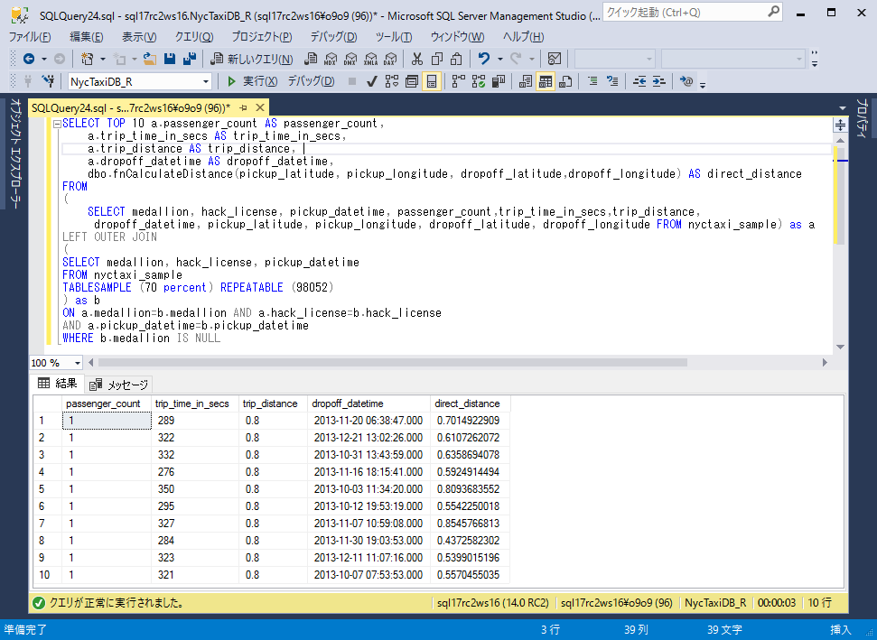
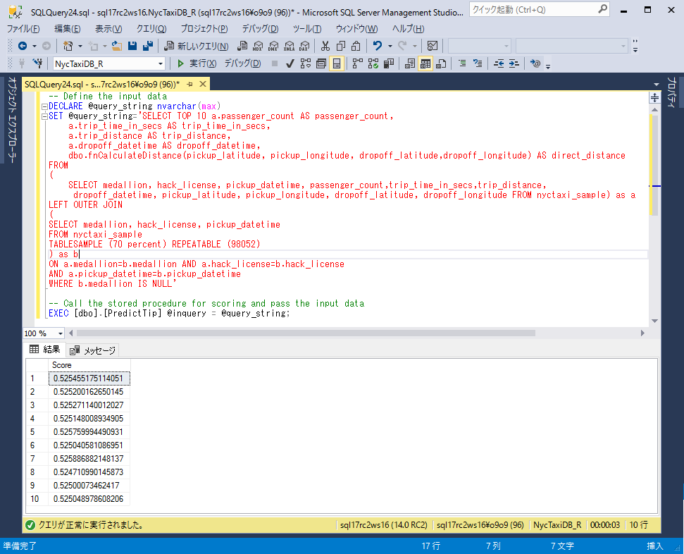
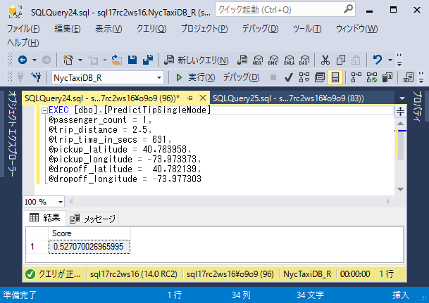

# Lesson 6: モデルの利用

このステップでは、ストアドプロシージャを使用してモデルを利用する方法を学びます。このストアドプロシージャは、他のアプリケーションから直接呼び出され、新しい観測値の予測を行うことができます。このチュートリアルでは、ストアドプロシージャのRモデルを使用してスコアリングを実行する2つの方法を示します。

- **バッチスコアリングモード**：SELECTクエリをストアドプロシージャの入力として使用します。ストアドプロシージャは入力に対応する観測値のテーブルを戻します

- **個々のスコアリングモード**：個々のパラメータ値のセットを入力として渡します。ストアドプロシージャは単一のレコードまたは値を返します。

## 出典

(Lesson 6: Operationalize the R model)[https://docs.microsoft.com/en-us/sql/advanced-analytics/tutorials/sqldev-operationalize-the-model]

## バッチスコアリング

1. 今回は小さな入力データセットを扱います。以下のクエリは予測を行うために必要な乗客数および他の特徴列を備えた10件の運転記録を返します。

    ```SQL
    SELECT TOP 10 a.passenger_count AS passenger_count,
        a.trip_time_in_secs AS trip_time_in_secs, 
        a.trip_distance AS trip_distance, 
        a.dropoff_datetime AS dropoff_datetime, 
        dbo.fnCalculateDistance(pickup_latitude, pickup_longitude, dropoff_latitude,dropoff_longitude) AS direct_distance
    FROM
    (
        SELECT medallion, hack_license, pickup_datetime, passenger_count,trip_time_in_secs,trip_distance,
        dropoff_datetime, pickup_latitude, pickup_longitude, dropoff_latitude, dropoff_longitude FROM nyctaxi_sample) AS a
    LEFT OUTER JOIN
    (
    SELECT medallion, hack_license, pickup_datetime
    FROM nyctaxi_sample
    ) AS b
    ON a.medallion=b.medallion AND a.hack_license=b.hack_license 
    AND a.pickup_datetime=b.pickup_datetime  
    WHERE b.medallion IS NULL
    ```

    

    このクエリの結果をバッチスコアリング用のストアドプロシージャ`PredictTip`への入力に使用します。

    ストアドプロシージャ`PredictTip`は[Lesson 2: PowerShellを使用したSQL Serverへのデータインポート](../r/sqldev-import-data-to-sql-server-using-powershell.md)を通じてSQL Serverに定義されています。

2.  Management Studioのオブジェクトエクスプローラで、[プログラミング]、[ストアドプロシージャ]の順に展開します。

3. `PredictTip`を右クリックし、[変更] を選択して新しいクエリウィンドウでTransact-SQLスクリプトを開きます。

    ```SQL
    CREATE PROCEDURE [dbo].[PredictTip] @inquery nvarchar(max)  
    AS  
    BEGIN  
      
      DECLARE @lmodel2 varbinary(max) = (SELECT TOP 1 model  
      FROM nyc_taxi_models);  
      EXEC sp_execute_external_script @language = N'R',  
                                      @script = N'  
    mod <- unserialize(as.raw(model));  
    print(summary(mod))  
    OutputDataSet<-rxPredict(modelObject = mod, data = InputDataSet, outData = NULL,   
              predVarNames = "Score", type = "response", writeModelVars = FALSE, overwrite = TRUE);  
    str(OutputDataSet)  
    print(OutputDataSet)  
    ',  
      @input_data_1 = @inquery, 
      @params = N'@model varbinary(max)',
      @model = @lmodel2  
      WITH RESULT SETS ((Score float));  
      
    END  
      
    GO
    ```

    - SELECT文はデータベースからシリアライズされたモデルが取り出しR変数の `mod`に格納します。
    - スコアリングを行う新しいケースは、ストアドプロシージャの最初のパラメータである@inqueryで指定されたTransact-SQLクエリから取得されます。クエリデータが読み込まれると、行はデフォルトデータフレームInputDataSetに保存されます。このデータフレームは、スコアを生成するRのrxPredict関数に渡されます。
    - `rxPredict`関数によって返される値は、**float**です。これは、ドライバがチップを得られる確率を表します。

4. 以下のように変数にクエリテキストを指定し、ストアドプロシージャのパラメータとして渡します。

    ```SQL
    -- Define the input data
    DECLARE @query_string nvarchar(max)
    SET @query_string='SELECT TOP 10 a.passenger_count AS passenger_count,
        a.trip_time_in_secs AS trip_time_in_secs, 
        a.trip_distance AS trip_distance, 
        a.dropoff_datetime AS dropoff_datetime, 
        dbo.fnCalculateDistance(pickup_latitude, pickup_longitude, dropoff_latitude,dropoff_longitude) AS direct_distance
    FROM
    (
        SELECT medallion, hack_license, pickup_datetime, passenger_count,trip_time_in_secs,trip_distance,
         dropoff_datetime, pickup_latitude, pickup_longitude, dropoff_latitude, dropoff_longitude FROM nyctaxi_sample) as a
    LEFT OUTER JOIN
    (
    SELECT medallion, hack_license, pickup_datetime
    FROM nyctaxi_sample
    TABLESAMPLE (70 percent) REPEATABLE (98052)
    ) as b
    ON a.medallion=b.medallion AND a.hack_license=b.hack_license 
    AND a.pickup_datetime=b.pickup_datetime  
    WHERE b.medallion IS NULL'
    
    -- Call the stored procedure for scoring and pass the input data
    EXEC [dbo].[PredictTip] @inquery = @query_string;
    ```

    

## 個々のスコアリング

場合によっては、アプリケーションから個々の値を渡して、それらの値に基づいて単一の結果を得たい場合もあります。 たとえば、ストアドプロシージャを呼び出し、ユーザーが入力または選択した、Excelワークシート、Webアプリケーション、またはReporting Servicesレポートを設定できます。

このセクションでは、ストアドプロシージャ`PredictTipSingleMode`を使用して単一の予測を作成する方法を学習します。

ストアドプロシージャ`PredictTipSingleMode`は[Lesson 2: PowerShellを使用したSQL Serverへのデータインポート](../r/sqldev-import-data-to-sql-server-using-powershell.md)を通じてSQL Serverに定義されています。

1. Management Studioのオブジェクトエクスプローラで、[プログラミング]、[ストアドプロシージャ]の順に展開します。

2. `PredictTipSingleMode`を右クリックし、[変更] を選択して新しいクエリウィンドウでTransact-SQLスクリプトを開きます。

    ```SQL
    CREATE PROCEDURE [dbo].[PredictTipSingleMode] @passenger_count int = 0,
    @trip_distance float = 0,
    @trip_time_in_secs int = 0,
    @pickup_latitude float = 0,
    @pickup_longitude float = 0,
    @dropoff_latitude float = 0,
    @dropoff_longitude float = 0
    AS  
    BEGIN  
      DECLARE @inquery nvarchar(max) = N'  
      SELECT * FROM [dbo].[fnEngineerFeatures](@passenger_count,  
    @trip_distance,  
    @trip_time_in_secs,  
    @pickup_latitude,  
    @pickup_longitude,  
    @dropoff_latitude,  
    @dropoff_longitude)  
        '  
      DECLARE @lmodel2 varbinary(max) = (SELECT TOP 1 model  
      FROM nyc_taxi_models);  
      EXEC sp_execute_external_script @language = N'R',  
                                      @script = N'  
    mod <- unserialize(as.raw(model));  
    print(summary(mod))  
    OutputDataSet<-rxPredict(modelObject = mod, data = InputDataSet, outData = NULL,   
              predVarNames = "Score", type = "response", writeModelVars = FALSE, overwrite = TRUE);  
    str(OutputDataSet)  
    print(OutputDataSet)  
    ',  
    @input_data_1 = @inquery,  
    @params = N'@model varbinary(max),@passenger_count int,@trip_distance float,@trip_time_in_secs int ,  
    @pickup_latitude float ,@pickup_longitude float ,@dropoff_latitude float ,@dropoff_longitude float',  
    @model = @lmodel2,  
    @passenger_count =@passenger_count ,  
    @trip_distance=@trip_distance,  
    @trip_time_in_secs=@trip_time_in_secs,    
    @pickup_latitude=@pickup_latitude,  
    @pickup_longitude=@pickup_longitude,  
    @dropoff_latitude=@dropoff_latitude,  
    @dropoff_longitude=@dropoff_longitude  
      WITH RESULT SETS ((Score float));  
    END
    ```
    
    - このストアドプロシージャは、乗客数、旅行距離などの複数の単一値を入力として受け取ります。
        ストアドプロシージャを外部アプリケーションから呼び出す場合は、データがRモデルの要件と一致していることを確認してください。これには、入力データをキャストしてRデータ型に変換したり、データ型とデータ長を検証することができます。
    - ストアドプロシージャは、格納されたRモデルに基づいてスコアを作成します。

2. 以下のように手動でパラメータをセットしストアドプロシージャ`PredictTipSingleMode`を実行します。

    ```
    EXEC [dbo].[PredictTipSingleMode]
    @passenger_count = 1,
    @trip_distance = 2.5,
    @trip_time_in_secs = 631,
    @pickup_latitude = 40.763958,
    @pickup_longitude = -73.973373,
    @dropoff_latitude =  40.782139,
    @dropoff_longitude = -73.977303
    ```
    
    

## まとめ

このチュートリアルでは、ストアドプロシージャに埋め込まれたRコードを操作する方法を学びました。Transact-SQLとの統合により、予測のためのPythonモデルのデプロイメントやエンタープライズデータワークフローの一部としてのモデル再トレーニングの組み込みがさらに簡単になることを確認しました。

## 前のステップ

[Lesson 5: T-SQLを使用したモデルのトレーニングと保存](../r/sqldev-train-and-save-a-model-using-t-sql.md)

## はじめから

[SQL開発者のための In-Database R 分析](../tutorials/sqldev-in-database-r-for-sql-developers.md)

## 関連項目

[Machine Learning Services with R](https://docs.microsoft.com/en-us/sql/advanced-analytics/r/sql-server-r-services)


<!--
---
title: "Lesson 6: Operationalize the R model| Microsoft Docs"
ms.custom: ""
ms.date: "08/23/2016"
ms.prod: "sql-server-2016"
ms.reviewer: ""
ms.suite: ""
ms.technology: 
  - "r-services"
ms.tgt_pltfrm: ""
ms.topic: "article"
applies_to: 
  - "SQL Server 2016"
dev_langs: 
  - "R"
  - "TSQL"
ms.assetid: 52b05828-11f5-4ce3-9010-59c213a674d1
caps.latest.revision: 11
author: "jeannt"
ms.author: "jeannt"
manager: "jhubbard"
---
# Lesson 6: Operationalize the R model

This article is part of a tutorial for SQL developers on how to use R in SQL Server.

In this step, you learn to *operationalize* the model using a stored procedure. This stored procedure can be called directly by other applications, to make predictions on new observations. The walkthrough demonstrates two ways to perform scoring using an R model in a stored procedure:

- **Batch scoring mode**: Use a SELECT query as an input to the stored procedure. The stored procedure returns a table of observations corresponding to the input cases.

- **Individual scoring mode**: Pass a set of individual parameter values as input.  The stored procedure returns a single row or value.

First, let's see how scoring works in general.

## Basic scoring

The stored procedure _PredictTip_ illustrates the basic syntax for wrapping a prediction call in a stored procedure.

```SQL
CREATE PROCEDURE [dbo].[PredictTip] @inquery nvarchar(max)  
AS  
BEGIN  
  
  DECLARE @lmodel2 varbinary(max) = (SELECT TOP 1 model  
  FROM nyc_taxi_models);  
  EXEC sp_execute_external_script @language = N'R',  
                                  @script = N'  
mod <- unserialize(as.raw(model));  
print(summary(mod))  
OutputDataSet<-rxPredict(modelObject = mod, data = InputDataSet, outData = NULL,   
          predVarNames = "Score", type = "response", writeModelVars = FALSE, overwrite = TRUE);  
str(OutputDataSet)  
print(OutputDataSet)  
',  
  @input_data_1 = @inquery, 
  @params = N'@model varbinary(max)',
  @model = @lmodel2  
  WITH RESULT SETS ((Score float));  
  
END  
  
GO
```

- The  SELECT statement gets the serialized model from the database, and stores the model in the R variable `mod` for further processing using R.

- The new cases for scoring are obtained from the [!INCLUDE[tsql](../../includes/tsql-md.md)] query specified in `@inquery`, the first parameter to the stored procedure. As the query data is read, the rows are saved in the default data frame, `InputDataSet`. This data frame is passed to the `rxPredict` function in R, which generates the scores.
  
    `OutputDataSet<-rxPredict(modelObject = mod, data = InputDataSet, outData = NULL,            predVarNames = "Score", type = "response", writeModelVars = FALSE, overwrite = TRUE);`
  
    Because a data.frame can contain a single row, you can use the same code for batch or single scoring.
  
-   The value returned by the `rxPredict` function is  a **float** that represents the probability that the driver gets a tip of any amount.

## Batch scoring

Now let's see how batch scoring works.

1.  Let's start by getting a smaller set of input data to work with. This query creates a "top 10" list of trips with passenger count and other features needed to make a prediction.
  
    ```SQL
    SELECT TOP 10 a.passenger_count AS passenger_count,
        a.trip_time_in_secs AS trip_time_in_secs, 
        a.trip_distance AS trip_distance, 
        a.dropoff_datetime AS dropoff_datetime, 
        dbo.fnCalculateDistance(pickup_latitude, pickup_longitude, dropoff_latitude,dropoff_longitude) AS direct_distance
    FROM
    (
        SELECT medallion, hack_license, pickup_datetime, passenger_count,trip_time_in_secs,trip_distance,
         dropoff_datetime, pickup_latitude, pickup_longitude, dropoff_latitude, dropoff_longitude FROM nyctaxi_sample)a
    LEFT OUTERJOIN
    (
    SELECT medallion, hack_license, pickup_datetime
    FROM nyctaxi_sample
    TABLESAMPLE (70 percent) REPEATABLE (98052)
    )b
    ON a.medallion=b.medallion AND a.hack_license=b.hack_license 
    AND a.pickup_datetime=b.pickup_datetime  
    WHERE b.medallion IS NULL
    ```

    **Sample results**
    
    ```
    passenger_count   trip_time_in_secs    trip_distance  dropoff_datetime   direct_distance
    1  283 0.7 2013-03-27 14:54:50.000   0.5427964547
    1  289 0.7 2013-02-24 12:55:29.000   0.3797099614
    1  214 0.7 2013-06-26 13:28:10.000   0.6970098661
    ```

    This query can be used as input to the stored procedure, _PredictTipBatchMode_, provided as part of the download.

2. Take a minute to review the code of the stored procedure _PredictTipBatchMode_ in [!INCLUDE[ssManStudio](../../includes/ssmanstudio-md.md)].

    ```SQL
    /****** Object:  StoredProcedure [dbo].[PredictTipBatchMode]  ******/
    CREATE PROCEDURE [dbo].[PredictTipBatchMode] @inquery nvarchar(max)
    AS
    BEGIN
      DECLARE @lmodel2 varbinary(max) = (SELECT TOP 1 model
      FROM nyc_taxi_models);
      EXEC sp_execute_external_script @language = N'R',
        @script = N'
          mod <- unserialize(as.raw(model));
          print(summary(mod))
          OutputDataSet<-rxPredict(modelObject = mod, data = InputDataSet, outData = NULL, predVarNames = "Score", type = "response", writeModelVars = FALSE, overwrite = TRUE);
          str(OutputDataSet)
          print(OutputDataSet)
        ',
      @input_data_1 = @inquery,
      @params = N'@model varbinary(max)',
      @model = @lmodel2
      WITH RESULT SETS ((Score float));
    END
    ```

3.  Provide the query text in a variable and pass it as a parameter to the stored procedure:

    ```SQL
    -- Define the input data
    DECLARE @query_string nvarchar(max)
    SET @query_string='
    select top 10 a.passenger_count as passenger_count,
        a.trip_time_in_secs as trip_time_in_secs,
        a.trip_distance as trip_distance,
        a.dropoff_datetime as dropoff_datetime,
        dbo.fnCalculateDistance(pickup_latitude, pickup_longitude, dropoff_latitude,dropoff_longitude) as direct_distance
    from
        select medallion, hack_license, pickup_datetime, passenger_count,trip_time_in_secs,trip_distance,
            dropoff_datetime, pickup_latitude, pickup_longitude, dropoff_latitude, dropoff_longitude
        from nyctaxi_sample
    )a  
    LEFT OUTER JOIN
    (
    SELECT medallion, hack_license, pickup_datetime
    FROM nyctaxi_sample  
    TABLESAMPLE (70 percent) REPEATABLE (98052)
    )b 
    ON a.medallion=b.medallion AND a.hack_license=b.hack_license AND a.pickup_datetime=b.pickup_datetime  
    WHERE b.medallion is null'

    -- Call the stored procedure for scoring and pass the input data
    EXEC [dbo].[PredictTip] @inquery = @query_string;
    ```
  
4. The stored procedure returns a series of values representing the prediction for each of the top ten trips. However, the top trips are also single-passenger trips with a relatively short trip distance, for which the driver is unlikely to get a tip.
  

> [!TIP]
> 
> Rather than returning just the yes-tip/no-tip results, you could also return the probability score for the prediction, and then apply  a WHERE clause to the _Score_ column values to categorize the score as "likely to tip" or "unlikely to tip", using a threshold value such as 0.5 or 0.7. This step is not included in the stored procedure but it would be easy to implement.

## Single-row scoring

Sometimes you want to pass in individual values from an application and get a single result based on those values. For example, you could set up an Excel worksheet, web application, or Reporting Services report to call the stored procedure and provide inputs typed or selected by users.

In this section, you'll learn how to create single predictions using a stored procedure.

1. Take a minute to review the code of the stored procedure _PredictTipSingleMode_, which was included as part of the download.
  
    ```SQL
    CREATE PROCEDURE [dbo].[PredictTipSingleMode] @passenger_count int = 0,
    @trip_distance float = 0,
    @trip_time_in_secs int = 0,
    @pickup_latitude float = 0,
    @pickup_longitude float = 0,
    @dropoff_latitude float = 0,
    @dropoff_longitude float = 0
    AS  
    BEGIN  
      DECLARE @inquery nvarchar(max) = N'  
      SELECT * FROM [dbo].[fnEngineerFeatures](@passenger_count,  
    @trip_distance,  
    @trip_time_in_secs,  
    @pickup_latitude,  
    @pickup_longitude,  
    @dropoff_latitude,  
    @dropoff_longitude)  
        '  
      DECLARE @lmodel2 varbinary(max) = (SELECT TOP 1 model  
      FROM nyc_taxi_models);  
      EXEC sp_execute_external_script @language = N'R',  
                                      @script = N'  
    mod <- unserialize(as.raw(model));  
    print(summary(mod))  
    OutputDataSet<-rxPredict(modelObject = mod, data = InputDataSet, outData = NULL,   
              predVarNames = "Score", type = "response", writeModelVars = FALSE, overwrite = TRUE);  
    str(OutputDataSet)  
    print(OutputDataSet)  
    ',  
    @input_data_1 = @inquery,  
    @params = N'@model varbinary(max),@passenger_count int,@trip_distance float,@trip_time_in_secs int ,  
    @pickup_latitude float ,@pickup_longitude float ,@dropoff_latitude float ,@dropoff_longitude float',  
    @model = @lmodel2,  
    @passenger_count =@passenger_count ,  
    @trip_distance=@trip_distance,  
    @trip_time_in_secs=@trip_time_in_secs,    
    @pickup_latitude=@pickup_latitude,  
    @pickup_longitude=@pickup_longitude,  
    @dropoff_latitude=@dropoff_latitude,  
    @dropoff_longitude=@dropoff_longitude  
      WITH RESULT SETS ((Score float));  
    END
    ```
  
    - This stored procedure takes multiple single values as input, such as passenger count, trip distance, and so forth.
  
        If you call the stored procedure  from an external application, make sure that the data matches the requirements of the R model. This might include ensuring that the input data can be cast or converted to an R data type, or validating data type and data length. For more information, see [Working with R Data Types](https://msdn.microsoft.com/library/mt590948.aspx).
  
    -   The stored procedure creates a score based on the stored R model.
  
2. Try it out, by providing the values manually.
  
    Open a new **Query** window, and call the stored procedure, providing values for each of the parameters. The parameters represent feature columns used by the model and are required.

    ```
    EXEC [dbo].[PredictTipSingleMode] @passenger_count = 0,
    @trip_distance float = 2.5,
    @trip_time_in_secs int = 631,
    @pickup_latitude float = 40.763958,
    @pickup_longitude float = -73.973373,
    @dropoff_latitude float =  40.782139,
    @dropoff_longitude float = 73.977303
    ```

    Or, use this shorter form supported for [parameters to a stored procedure](https://docs.microsoft.com/sql/relational-databases/stored-procedures/specify-parameters):
  
    ```SQL
    EXEC [dbo].[PredictTipSingleMode] 1, 2.5, 631, 40.763958,-73.973373, 40.782139,-73.977303
    ```

3. The results indicate that the probability of getting a tip is very low on these top 10 trips, since all are single-passenger trips over a relatively short distance.

## Conclusions

This concludes the tutorial. Now that you have learned to embed R code in stored procedures, you can extend these practices to build models of your own. The integration with [!INCLUDE[tsql](../../includes/tsql-md.md)] makes it much easier to deploy R models for prediction and to incorporate model retraining as part of an enterprise data workflow.

## Previous lesson

[Lesson 5: Train and save an R model using T-SQL](../r/sqldev-train-and-save-a-model-using-t-sql.md)
-->
