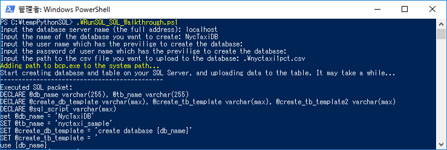
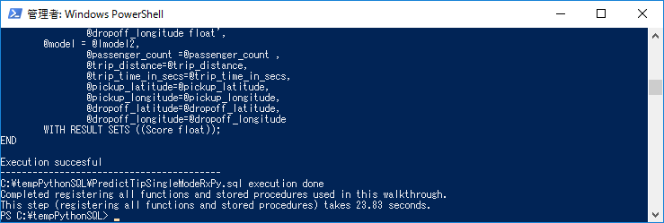
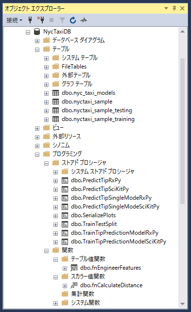

# Step 2: PowerShellを使用したSQL Serverへのデータインポート

このステップでは、ダウンロードしたスクリプトの1つを実行して、チュートリアルに必要なデータベースオブジェクトを作成します。このスクリプトは、使用するストアドプロシージャのほとんども作成し、指定したデータベースのテーブルにサンプルデータをロードします。

## 出典
[Step 2: Import Data to SQL Server using PowerShell](https://docs.microsoft.com/en-us/sql/advanced-analytics/tutorials/sqldev-py2-import-data-to-sql-server-using-powershell)

## オブジェクト作成とデータロード

ダウンロードしたファイル群の中のPowerShellスクリプト`RunSQL_SQL_Walkthrough.ps1`を実行し、チュートリアル環境を準備します。このスクリプトは次のアクションを実行します：

- SQL Native ClientおよびSQLコマンドラインユーティリティがインストールされていない場合はインストールします。これらは、bcpを使用してデータをバルクロードするために必要です。

- SQL Serverインスタンスにデータベースとテーブルを作成し、そこへデータをバルクロードします。

- さらに複数の関数とストアドプロシージャを作成します。

## スクリプトの実行

1. 管理者としてPowerShellコマンドプロンプトを開き、次のコマンドを実行します。
  
    ```PowerShell:PowerShell
    .\RunSQL_SQL_Walkthrough.ps1
    ```

    次の情報を入力するよう求められます。
    - Machine Learning Services（Python）がインストールされているサーバ名またはアドレス。
    - 作成するデータベースの名前
    - 対象のSQL Serverのユーザー名とパスワード。このユーザは、データベース、テーブル、ストアドプロシージャ、関数の作成権限、およびテーブルへのデータロード権限が必要です。ユーザー名とパスワードを省略した場合は現在のWindowsユーザによってログインします。
    - ダウンロードしたファイル群の中のサンプルデータファイル`nyctaxi1pct.csv`のパス。例えば、`C:\tempPythonSQL\nyctaxi1pct.csv`です。

    
    

2. 上記手順の一環で指定したデータベース名とユーザー名をプレースホルダに置き換えるように、すべてのT-SQLスクリプトが変更されています。
  
3. T-SQLスクリプトによって作成されるストアドプロシージャと関数がデータベース内に作成されていることを確認します。
     
    |**T-SQLスクリプトファイル**|**ストアドプロシージャ／関数**|
    |------|------|
    |create-db-tb-upload-data.sql|データベースと2つのテーブルを作成します。<br /><br />テーブル`nyctaxi_sample`: メインとなるNYC Taxiデータセットが登録されます。ロードされるデータはNYC Taxiデータセットの1％のサンプルです。クラスタ化カラムストアインデックスの定義によってストレージ効率とクエリパフォーマンスを向上させています。<br /><br />テーブル`nyc_taxi_models`: 訓練された高度な分析モデルが登録されます。|
    |fnCalculateDistance.sql|乗車位置と降車位置の間の直接距離を計算するスカラー値関数`fnCalculateDistance`を作成します。|
    |fnEngineerFeatures.sql|モデルトレーニング用の新しい特徴抽出を作成するテーブル値関数`fnEngineerFeatures`を作成します。|
    |TrainingTestingSplit.sql|nyctaxi_sampleテーブルのデータを、nyctaxi_sample_trainingとnyctaxi_sample_testingの2つに分割するプロシージャ`TrainingTestingSplit`を作成します。|
    |PredictTipSciKitPy.sql|モデルを使用した予測のために、scikit-learnで作成した訓練されたモデルを呼び出すプロシージャ`PredictTipSciKitPy`を作成します。プロシージャは、入力パラメータとしてクエリを受け入れ、入力行に対するスコアを含む数値の列を戻します。|
    |PredictTipRxPy.sql|モデルを使用した予測のために、RevoScalePyで作成した訓練されたモデルを呼び出すプロシージャ`PredictTipRxPy`を作成します。プロシージャは、入力パラメータとしてクエリを受け入れ、入力行に対するスコアを含む数値の列を戻します。|
    |PredictTipSingleModeSciKitPy.sql|モデルを使用した予測のために、scikit-learnで作成した訓練されたモデルを呼び出すプロシージャ`PredictTipSingleModeSciKitPy`を作成します。このストアドプロシージャは新しい観測値を入力として、個々の特徴値はインラインパラメータとして受け取り、新しい観測値に対する予測値を返します。|
    |PredictTipSingleModeRxPy.sql|モデルを使用した予測のために、scikit-learnで作成した訓練されたモデルを呼び出すプロシージャ`PredictTipSingleModeRxPy`を作成します。このストアドプロシージャは新しい観測値を入力として、個々の特徴値はインラインパラメータとして受け取り、新しい観測値に対する予測値を返します。|
    |SerializePlots.sql|データ探索用のプロシージャ`SerializePlots`を作成します。このストアドプロシージャは、Pythonを使用してグラフィックを作成し、グラフオブジェクトをシリアライズします。|
    |TrainTipPredictionModelSciKitPy.sql|scikit-learnによるロジスティック回帰モデルを訓練するプロシージャ`TrainTipPredictionModelSciKitPy`を作成します。このモデルはランダムに選択された60％のデータを使用して訓練され、tipped値（チップをもらうか否か）を予測します。ストアドプロシージャの出力は訓練されたモデルであり、テーブル`nyc_taxi_models`に登録されます。|
    |TrainTipPredictionModelRxPy.sql|RevoScalePyによるロジスティック回帰モデルを訓練するプロシージャ`TrainTipPredictionModelRxPy`を作成します。このモデルはランダムに選択された60％のデータを使用して訓練され、tipped値（チップをもらうか否か）を予測します。ストアドプロシージャの出力は訓練されたモデルであり、テーブル`nyc_taxi_models`に登録されます。|
  
    

    > [!NOTE]
    > T-SQLスクリプトはデータベースオブジェクトを再作成しないため、すでに存在する場合にはデータが重複して登録されます。そのため、スクリプトを再実行する場合は事前に既存オブジェクトを削除してください。

## **重要**：一部オブジェクトの再定義

以下のSQLを実行し一部のオブジェクトを再定義します。
**SQL Server 2017 CTP から SQL Server 2017 RC にバージョンアップした際にRevoScalePyの仕様が変更されたため、その仕様変更に対応させることがこの再定義の主な理由です。**

- [TrainTipPredictionModelSciKitPy](https://github.com/gho9o9/sql-docs/blob/live/docs/advanced-analytics/tutorials/assets/tempPythonSQL/Alter_TrainTipPredictionModelSciKitPy.sql)
- [TrainTipPredictionModelRxPy](https://github.com/gho9o9/sql-docs/blob/live/docs/advanced-analytics/tutorials/assets/tempPythonSQL/Alter_TrainTipPredictionModelRxPy.sql)
- [PredictTipSciKitPy](https://github.com/gho9o9/sql-docs/blob/live/docs/advanced-analytics/tutorials/assets/tempPythonSQL/Alter_PredictTipSciKitPy.sql)
- [PredictTipRxPy](https://github.com/gho9o9/sql-docs/blob/live/docs/advanced-analytics/tutorials/assets/tempPythonSQL/Alter_PredictTipRxPy.sql)
- [PredictTipSingleModeSciKitPy](https://github.com/gho9o9/sql-docs/blob/live/docs/advanced-analytics/tutorials/assets/tempPythonSQL/Alter_PredictTipSingleModeSciKitPy.sql)
- [PredictTipSingleModeRxPy](https://github.com/gho9o9/sql-docs/blob/live/docs/advanced-analytics/tutorials/assets/tempPythonSQL/Alter_PredictTipSingleModeRxPy.sql)

## 次のステップ

[Step 3: データの探索と可視化](sqldev-py3-explore-and-visualize-the-data.md)

## 前のステップ

[Step 1: サンプルデータのダウンロード](sqldev-py1-download-the-sample-data.md)

## はじめから

[SQL開発者のための In-Database Python 分析](sqldev-in-database-python-for-sql-developers.md)

## 関連項目

[Machine Learning Services with Python](https://docs.microsoft.com/en-us/sql/advanced-analytics/python/sql-server-python-services)

<!--
---
title: "Step 2: Import Data to SQL Server using PowerShell | Microsoft Docs"
ms.custom: ""
ms.date: "05/25/2017"
ms.prod: "sql-server-vnext-ctp2"
ms.reviewer: ""
ms.suite: ""
ms.technology: 
  - "r-services"
ms.tgt_pltfrm: ""
ms.topic: "article"
applies_to: 
  - "SQL Server 2017"
dev_langs: 
  - "Python"
  - "TSQL"
ms.assetid:
caps.latest.revision: 2
author: "jeannt"
ms.author: "jeannt"
manager: "jhubbard"
---
# Step 2: Import Data to SQL Server using PowerShell

In this step, you'll run one of the downloaded scripts, to create the database objects required for the walkthrough. The script also creates most of the stored procedures you'll use, and uploads the sample data to a table in the database you specified.

## Create SQL Objects and Data

Among the downloaded files you should see a PowerShell script. To prepare the environment for the walkthrough, you'll run this script.  The script performs these actions:

- Installs the SQL Native Client and SQL command-line utilities, if not already installed. These utilities are required for bulk-loading the data to the database using **bcp**.

- Creates a database and a table on the [!INCLUDE[ssNoVersion](../../includes/ssnoversion-md.md)] instance, and bulk-inserts data into the table.

- Creates multiple SQL functions and stored procedures.

### Run the script

1. Open a PowerShell command prompt as administrator and run the following command.
  
    ```  
    .\RunSQL_SQL_Walkthrough.ps1  
    ```  

    You will be prompted to input the following information:
    - The name or address of a [!INCLUDE[ssCurrent](../../includes/sscurrent-md.md)] instance where machine learning Services with Python has been installed
    - The user name and password for an account on the instance. The account you use must have the ability to create databases, create tables and stored procedures, and upload data to tables. If you do not provide the user name and password, your Windows identity is used to sign in to SQL Server.
    - The path and file name of the sample data file that you just downloaded. For example, `C:\tempRSQL\nyctaxi1pct.csv`

	> [!NOTE]
	> Make sure that your xmlrw.dll is in the same folder as your bcp.exe. If not, please copy it over.

2.  As part of this step, all the [!INCLUDE[tsql](../../includes/tsql-md.md)] scripts are also modified to replace placeholders with the database name and user name that you provide as script inputs.
  
3. Take a minute to review the stored procedures and functions created by the script.
     
    |**SQL script file name**|**Function**|
    |------|------|
    |create-db-tb-upload-data.sql|Creates a database and two tables:<br /><br />nyctaxi_sample: Contains the main NYC Taxi dataset. A clustered columnstore index is added to the table to improve storage and query performance. The 1% sample of the NYC Taxi dataset will be inserted into this table.<br /><br />nyc_taxi_models: Used to persist the trained advanced analytics model.|
    |fnCalculateDistance.sql|Creates a scalar-valued function that calculates the direct distance between pickup and dropoff locations|
    |fnEngineerFeatures.sql|Creates a table-valued function that creates new data features for model training|
    |TrainingTestingSplit.sql|Split the data in the nyctaxi_sample table into two parts: nyctaxi_sample_training and nyctaxi_sample_testing.|
    |PredictTipSciKitPy.sql|Creates a stored procedure that calls the trained model (scikit-learn) to create predictions using the model. The stored procedure accepts a query as its input parameter and returns a column of numeric values containing the scores for the input rows.|
    |PredictTipRxPy.sql|Creates a stored procedure that calls the trained model (revoscalepy) to create predictions using the model. The stored procedure accepts a query as its input parameter and returns a column of numeric values containing the scores for the input rows.|
    |PredictTipSingleModeSciKitPy.sql|Creates a stored procedure that calls the trained model (scikit-learn) to create predictions using the model. This stored procedure accepts a new observation as input, with individual feature values passed as in-line parameters, and returns a value that predicts the outcome for the new observation.|
    |PredictTipSingleModeRxPy.sql|Creates a stored procedure that calls the trained model (revoscalepy) to create predictions using the model. This stored procedure accepts a new observation as input, with individual feature values passed as in-line parameters, and returns a value that predicts the outcome for the new observation.|
  
4. You'll create some additional stored procedures in the latter part of this walkthrough:
    
    |**SQL script file name**|**Function**|
    |------|------|
    |SerializePlots.sql|Creates a stored procedure for data exploration. This stored procedure creates a graphic using Python and then serialize the graph objects.|
    |TrainTipPredictionModelSciKitPy.sql|Creates a stored procedure that trains a logistic regression model (scikit-learn). The model predicts the value of the  tipped column, and is trained using a randomly selected 60% of the data. The output of the stored procedure is the trained model, which is saved in the table nyc_taxi_models.|
    |TrainTipPredictionModelRxPy.sql|Creates a stored procedure that trains a logistic regression model (revoscalepy). The model predicts the value of the  tipped column, and is trained using a randomly selected 60% of the data. The output of the stored procedure is the trained model, which is saved in the table nyc_taxi_models.|
  
3. Log in to the [!INCLUDE[ssNoVersion](../../includes/ssnoversion-md.md)] instance using [!INCLUDE[ssManStudioFull](../../includes/ssmanstudiofull-md.md)] and the login you specified, to verify that you can see the database, tables, functions, and stored procedures that were created.

    

    > [!NOTE]
    > If the database objects already exist, they cannot be created again. If the table already exists, the data will be appended, not overwritten. Therefore, be sure to drop any existing objects before running the script.
    > Follow instructions [here](https://docs.microsoft.com/en-us/sql/advanced-analytics/r/set-up-sql-server-r-services-in-database#bkmk_enableFeature) to enable external scrip services.
    


## Next Step

[Step 3: Explore and Visualize the Data](sqldev-py3-explore-and-visualize-the-data.md)

## Previous Step

[Step 1: Download the Sample Data](sqldev-py1-download-the-sample-data.md)

## See Also

[Machine Learning Services with Python](../python/sql-server-python-services.md)


-->
