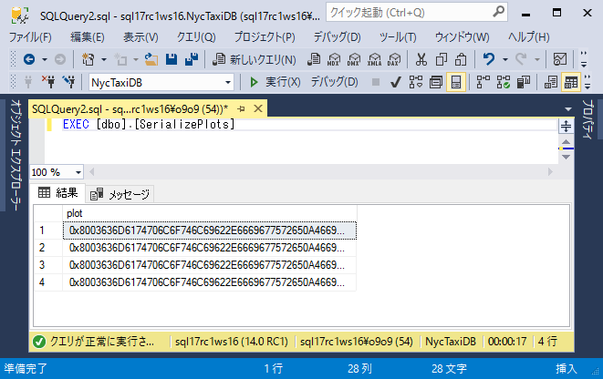
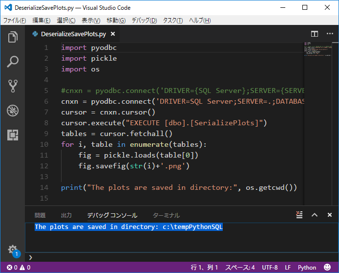
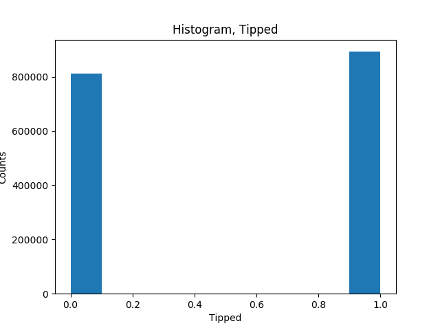
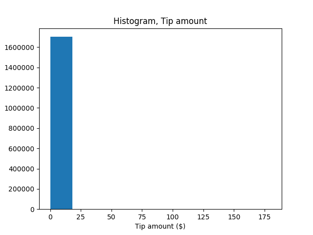
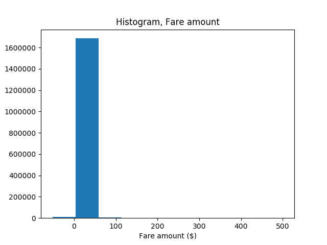

# Step 3: データの探索と可視化

データサイエンスソリューション開発には、通常、集中的なデータの探索とデータの可視化が含まれます。このステップでは、サンプルデータを探索しいくつかのプロットを生成します。さらに、Pythonでグラフィックスオブジェクトをシリアライズする方法、およびデシリアライズしてプロットを作成する方法を学習します。

> [!NOTE]
> このチュートリアルでは二項分類モデルのみを示します。回帰分類や多項分類などほかのモデルを構築することも可能です。

## データの確認

元のデータセットにはタクシー識別子と運転記録が別々のファイルで提供されていますが、サンプルデータを使いやすくするためにmedallion、hack_license、pickup_datetimeをキーにジョインしています。また使用するレコードは、元のレコード数の1％でサンプリングしています。サンプリングされたデータセットは1,703,957の行と23の列を持っています。

**タクシー識別子**

- medallion列はタクシーの一意なID番号を示します。
- hack_license列は運転手の匿名化された運転免許証番号を示します。

**運転記録および運賃記録**

- 各運転記録には、乗車と降車の場所と時間、および運転距離が含まれます。
- 各運賃記録には、支払タイプ、合計支払い額、チップ金額などの支払情報が含まれます。
- 最後の3つの列は、さまざまな機械学習タスクに使用できます。
    - tip_amount列は連続した数値が含まれ、回帰分析のためのラベル列（目的変数）として使用できます。
    - tipped列は yes / no 値のみがあり、二項分類のためのラベル列（目的変数）として使用できます。
    - tip_class列は複数の**クラスラベル**があり、多項分類のためのラベル列（目的変数）として使用できます。
- ラベル列として使用される値はtip_amount列に基づいています。

    |列|ルール|
    |-|-|
     |tipped|If tip_amount > 0, tipped = 1, otherwise tipped = 0|
    |tip_class|Class 0: tip_amount = $0<br /><br />Class 1: tip_amount > $0 and tip_amount <= $5<br /><br />Class 2: tip_amount > $5 and tip_amount <= $10<br /><br />Class 3: tip_amount > $10 and tip_amount <= $20<br /><br />Class 4: tip_amount > $20|

## T-SQL内のPythonでプロットを作成する

可視化はデータと異常値の分布を理解するために重要で、Pythonにはデータ可視化のための多くのパッケージが提供されています。matplotlibモジュールは、ヒストグラム、散布図、箱ひげ図、およびその他のデータ探索グラフを作成するための多くの機能を含みます。

このセクションでは、ストアドプロシージャを使用してプロットを操作する方法を学習します。ここではプロットをvarbinary型のデータとして扱っています。

## プロットをvarbinaryデータ型として格納する

SQL Server 2017 Machine Learning Servicesに含まれるPythonライブラリの**RevoScalePy**パッケージは、RライブラリのRevoScaleRパッケージに相当します。この例ではrxHistogramを使用し、Transact-SQLクエリの結果データに基づいたヒストグラムをプロットします。利用を簡単にするためにPlotHistogramストアドプロシージャでラップします。

このストアドプロシージャはシリアライズされたPython描画オブジェクトをvarbinaryデータのストリームとして返します。バイナリデータは直接表示することはできませんが、クライアント上でPythonコードを使用してバイナリデータをデシリアライズし、その画像ファイルをクライアントコンピュータに保存します。

## SerializePlotsストアドプロシージャを定義する

ストアドプロシージャ`SerializePlots`は[Step 2: PowerShellを使用したSQL Serverへのデータインポート](sqldev-py2-import-data-to-sql-server-using-powershell.md)を通じてSQL Serverに定義されています。

1. Management Studioのオブジェクトエクスプローラで、[プログラミング]、[ストアドプロシージャ]の順に展開します。

2. `SerializePlots`を右クリックし、[変更] を選択して新しいクエリウィンドウでTransact-SQLスクリプトを開きます。
    
    ```SQL:SerializePlots
    
    CREATE PROCEDURE [dbo].[SerializePlots]
    AS
    BEGIN
      SET NOCOUNT ON;
      DECLARE @query nvarchar(max) =
      N'SELECT cast(tipped as int) as tipped, tip_amount, fare_amount FROM [dbo].[nyctaxi_sample]'
      EXECUTE sp_execute_external_script
      @language = N'Python',
      @script = N'
    import matplotlib
    matplotlib.use("Agg")
    import matplotlib.pyplot as plt
    import pandas as pd
    import pickle

    fig_handle = plt.figure()
    plt.hist(InputDataSet.tipped)
    plt.xlabel("Tipped")
    plt.ylabel("Counts")
    plt.title("Histogram, Tipped")
    plot0 = pd.DataFrame(data =[pickle.dumps(fig_handle)], columns =["plot"])
    plt.clf()

    plt.hist(InputDataSet.tip_amount)
    plt.xlabel("Tip amount ($)")
    plt.ylabel("Counts")
    plt.title("Histogram, Tip amount")
    plot1 = pd.DataFrame(data =[pickle.dumps(fig_handle)], columns =["plot"])
    plt.clf()

    plt.hist(InputDataSet.fare_amount)
    plt.xlabel("Fare amount ($)")
    plt.ylabel("Counts")
    plt.title("Histogram, Fare amount")
    plot2 = pd.DataFrame(data =[pickle.dumps(fig_handle)], columns =["plot"])
    plt.clf()

    plt.scatter( InputDataSet.fare_amount, InputDataSet.tip_amount)
    plt.xlabel("Fare Amount ($)")
    plt.ylabel("Tip Amount ($)")
    plt.title("Tip amount by Fare amount")
    plot3 = pd.DataFrame(data =[pickle.dumps(fig_handle)], columns =["plot"])
    plt.clf()

    OutputDataSet = plot0.append(plot1, ignore_index=True).append(plot2, ignore_index=True).append(plot3, ignore_index=True)
    ',
                                     @input_data_1 = @query
      WITH RESULT SETS ((plot varbinary(max)))
    END

    GO
  
    ```

    - 変数`@query`は、Pythonコードブロックへのインプット`@input_data_1`として渡されるクエリテキストを定義しています。
    - **matplotlibライブラリ**の`figure`によってヒストグラムと散布図を作成し、これらのオブジェクトを**pickleライブラリ**を使用してシリアライズしています。
    - Python描画オブジェクトはアウトプットのために**pandas**データフレームへシリアライズされます。

## varbinaryデータを画像ファイルとして出力する

1.  Management Studioで以下のクエリを実行します。
  
    ```
    EXEC [dbo].[SerializePlots]
    ```
  
    
  
2.  ダウンロードしたファイル群の中のPythonスクリプト`DeserializeSavePlots.py`内の接続文字列を環境に合わせて変更した後、実行します。
  
    **SQL Server 認証の場合**
    
        ```python:DeserializeSavePlots.py
        import pyodbc
        import pickle
        import os
        cnxn = pyodbc.connect('DRIVER={SQL Server};SERVER={SERVER_NAME};DATABASE={DB_NAME};UID={USER_NAME};PWD={PASSOWRD}')
        cursor = cnxn.cursor()
        cursor.execute("EXECUTE [dbo].[SerializePlots]")
        tables = cursor.fetchall()
        for i in range(0, len(tables)):
            fig = pickle.loads(tables[i][0])
            fig.savefig(str(i)+'.png')
        print("The plots are saved in directory: ",os.getcwd())
        ```  
    **Windows認証の場合**

        ```python:DeserializeSavePlots.py
        import pyodbc
        import pickle
        import os
        cnxn = pyodbc.connect('DRIVER={SQL Server};SERVER={SERVER_NAME};DATABASE={DB_NAME};Trusted_Connection=yes;')
        cursor = cnxn.cursor()
        cursor.execute("EXECUTE [dbo].[SerializePlots]")
        tables = cursor.fetchall()
        for i in range(0, len(tables)):
            fig = pickle.loads(tables[i][0])
            fig.savefig(str(i)+'.png')
        print("The plots are saved in directory: ",os.getcwd())
        ```

    > [!NOTE]
    > Pythonのランタイムのバージョンをサーバとクライアントで合わせてください。またクライアントで使用するmatplotlibなどPythonライブラリのバージョンはサーバと合わせるもしくは上位のバージョンとしてください。

3.  接続が成功すると、以下の結果が表示されます。
  
    
  
4.  4つのファイルがPythonの作業ディレクトリに作成されます。

    - チップが得られた数と得られなかった数を示します。
    
    
    - チップ金額の分布を示します。
    
    
    - 運賃の分布を示します。
    
    
    - x軸上に運賃、y軸上にチップ金額とした散布図です。
    
    
## 次のステップ

[Step 4: T-SQLを使用したデータの特徴抽出](sqldev-py4-create-data-features-using-t-sql.md)

## 前のステップ

[Step 2: PowerShellを使用したSQL Serverへのデータインポート](sqldev-py2-import-data-to-sql-server-using-powershell.md)

## はじめから

[SQL開発者のための In-Database Python 分析](sqldev-in-database-python-for-sql-developers.md)

## 関連項目

[Machine Learning Services with Python](https://docs.microsoft.com/en-us/sql/advanced-analytics/python/sql-server-python-services)

<!--
---
title: "Step 3: Explore and Visualize the Data | Microsoft Docs"
ms.custom: ""
ms.date: "05/25/2017"
ms.prod: "sql-server-2017"
ms.reviewer: ""
ms.suite: ""
ms.technology: 
  - "sql-python"
ms.tgt_pltfrm: ""
ms.topic: "article"
applies_to: 
  - "SQL Server 2017"
dev_langs: 
  - "Python"
  - "TSQL"
ms.assetid: 
caps.latest.revision: 2
author: "jeannt"
ms.author: "jeannt"
manager: "jhubbard"
---
# Step 3: Explore and Visualize the Data

Developing a data science solution usually includes intensive data exploration and data visualization. In this step, you'll explore the sample data and generate some plots. Later, you'll learn how to serialize graphics objects in Python, and then deserialize those object and make plots.

> [!NOTE]
> This walkthrough demonstrates only the binary classification task; you are welcome to try building separate models for the other two machine learning tasks, regression and multiclass classification.

## Review the Data

In the original dataset, the taxi identifiers and trip records were provided in separate files. However, to make the sample data easier to use, the two original datasets have been joined on the columns _medallion_, _hack_license_, and _pickup_datetime_.  The records were also sampled to get just 1% of the original number of records. The resulting down-sampled dataset has 1,703,957 rows and 23 columns.

**Taxi identifiers**

- The _medallion_ column represents the taxi’s unique id number.
- The _hack_license_ column contains the taxi driver's license number (anonymized) .

**Trip and fare records**

- Each trip record includes the pickup and drop-off location and time, and the trip distance.
- Each fare record includes payment information such as the payment type, total amount of payment, and the tip amount.
- The last three columns can be used for various machine learning tasks.  The _tip_amount_ column contains continuous numeric values and can be used as the **label** column for regression analysis. The _tipped_ column has only yes/no values and is used for binary classification. The _tip_class_ column has multiple **class labels** and therefore can be used as the label for multi-class classification tasks.
- The values used for the label columns are all based on the _tip_amount_ column, using these business rules:
  
    |Derived column name|Rule|
    |-|-|
     |tipped|If tip_amount > 0, tipped = 1, otherwise tipped = 0|
    |tip_class|Class 0: tip_amount = $0<br /><br />Class 1: tip_amount > $0 and tip_amount <= $5<br /><br />Class 2: tip_amount > $5 and tip_amount <= $10<br /><br />Class 3: tip_amount > $10 and tip_amount <= $20<br /><br />Class 4: tip_amount > $20|

## Create Plots using Python in T-SQL

Because visualization is such a powerful tool for understanding the distribution of the data and outliers, Python provides many packages for visualizing data. The **matplotlib** module is a popular library that includes many functions for creating histograms, scatter plots, box plots, and other data exploration graphs.

In this section, you'll learn how to work with plots using stored procedures. You'll store the `plot` Python object as a **varbinary** data type, and save the plots generated on the server.

### Storing plots as varbinary data type

The **revoscalepy** module included with SQL Server 2017 Machine Learning Services contains libraries analogous to the R libraries in the RevoScaleR package. In this example, you'll use the Python equivalent of `rxHistogram` to plot a histogram based on data from a [!INCLUDE[tsql](../../includes/tsql-md.md)] query. To make it easier, you will wrap it in a stored procedure, _PlotHistogram_.

The stored procedure returns a serialized Python `figure` object as a stream of **varbinary** data. You cannot view the binary data directly, but you can use Python code on the client to deserialize and view the figures, and then save the image file on a client computer.

### Create the stored procedure Plots_Python

1.  In [!INCLUDE[ssManStudioFull](../../includes/ssmanstudiofull-md.md)], open a new **Query** window.

2.  Select the database for the walkthrough,  and create the procedure using this statement. Be sure to modify the code to use the correct table name, if needed.
  
    ```SQL
    
	CREATE PROCEDURE [dbo].[SerializePlots]
	AS
	BEGIN
      SET NOCOUNT ON;
      DECLARE @query nvarchar(max) =
      N'SELECT cast(tipped as int) as tipped, tip_amount, fare_amount FROM [dbo].[nyctaxi_sample]'
	  EXECUTE sp_execute_external_script
	  @language = N'Python',
      @script = N'
	import matplotlib
	matplotlib.use("Agg")
	import matplotlib.pyplot as plt
	import pandas as pd
	import pickle

	fig_handle = plt.figure()
	plt.hist(InputDataSet.tipped)
	plt.xlabel("Tipped")
	plt.ylabel("Counts")
	plt.title("Histogram, Tipped")
	plot0 = pd.DataFrame(data =[pickle.dumps(fig_handle)], columns =["plot"])
	plt.clf()

	plt.hist(InputDataSet.tip_amount)
	plt.xlabel("Tip amount ($)")
	plt.ylabel("Counts")
	plt.title("Histogram, Tip amount")
	plot1 = pd.DataFrame(data =[pickle.dumps(fig_handle)], columns =["plot"])
	plt.clf()

	plt.hist(InputDataSet.fare_amount)
	plt.xlabel("Fare amount ($)")
	plt.ylabel("Counts")
	plt.title("Histogram, Fare amount")
	plot2 = pd.DataFrame(data =[pickle.dumps(fig_handle)], columns =["plot"])
	plt.clf()

	plt.scatter( InputDataSet.fare_amount, InputDataSet.tip_amount)
	plt.xlabel("Fare Amount ($)")
	plt.ylabel("Tip Amount ($)")
	plt.title("Tip amount by Fare amount")
	plot3 = pd.DataFrame(data =[pickle.dumps(fig_handle)], columns =["plot"])
	plt.clf()

	OutputDataSet = plot0.append(plot1, ignore_index=True).append(plot2, ignore_index=True).append(plot3, ignore_index=True)
	',
                                     @input_data_1 = @query
	  WITH RESULT SETS ((plot varbinary(max)))
	END

	GO
  
    ```
**Notes:**

- The variable `@query` defines the query text (`'SELECT tipped FROM nyctaxi_sample'`), which is passed to the Python code block as the argument to the script input variable, `@input_data_1`.
- The Python script is fairly simple: **matplotlib** `figure` objects are used to make the histogram and scatter plot, and these objects are then serialized using the `pickle` library.
- The Python graphics object is serialized to an Python **pandas** DataFrame for output.

### Output varbinary data to viewable graphics file

1.  In [!INCLUDE[ssManStudio](../../includes/ssmanstudio-md.md)], run the following statement:
  
    ```
    EXEC [dbo].[SerializePlots]
    ```
  
	**Results**
  
	*plot*
	*0xFFD8FFE000104A4649...*
	*0xFFD8FFE000104A4649...*
	*0xFFD8FFE000104A4649...*
	*0xFFD8FFE000104A4649...*

  
2.  On the client machine, run the following Python code, replacing the server name, database name, and credentials as appropriate.
  
    **For SQL server authentication:**
    
        ```python
        import pyodbc
        import pickle
        import os
        cnxn = pyodbc.connect('DRIVER={SQL Server};SERVER={SERVER_NAME};DATABASE={DB_NAME};UID={USER_NAME};PWD={PASSOWRD}')
        cursor = cnxn.cursor()
        cursor.execute("EXECUTE [dbo].[SerializePlots]")
        tables = cursor.fetchall()
        for i in range(0, len(tables)):
            fig = pickle.loads(tables[i][0])
            fig.savefig(str(i)+'.png')
        print("The plots are saved in directory: ",os.getcwd())
        ```  
    **For Windows authentication:**

        ```python
        import pyodbc
        import pickle
        import os
        cnxn = pyodbc.connect('DRIVER={SQL Server};SERVER={SERVER_NAME};DATABASE={DB_NAME};Trusted_Connection=yes;')
        cursor = cnxn.cursor()
        cursor.execute("EXECUTE [dbo].[SerializePlots]")
        tables = cursor.fetchall()
        for i in range(0, len(tables)):
            fig = pickle.loads(tables[i][0])
            fig.savefig(str(i)+'.png')
        print("The plots are saved in directory: ",os.getcwd())
        ```

    > [!NOTE]
    > Make sure the Python version is the same on the client and the server. Also, make sure that the Python libraries you’re using on your client (such as matplotlib) are of the same or higher version relative to the libraries installed on the server.


3.  If the connection is successful, you will see the results below
  
	*The plots are saved in directory: xxxx*
  
4.  The output file will be created in the Python working directory. To view the plot, just open the Python working directory. The following image shows an example plot saved on the client computer.
  
     

## Next Step

[Step 4: Create Data Features using T-SQL](sqldev-py5-train-and-save-a-model-using-t-sql.md)

## Previous Step

[Step 2: Import Data to SQL Server using PowerShell](sqldev-py2-import-data-to-sql-server-using-powershell.md)

## See Also

[Machine Learning Services with Python](../python/sql-server-python-services.md)
-->