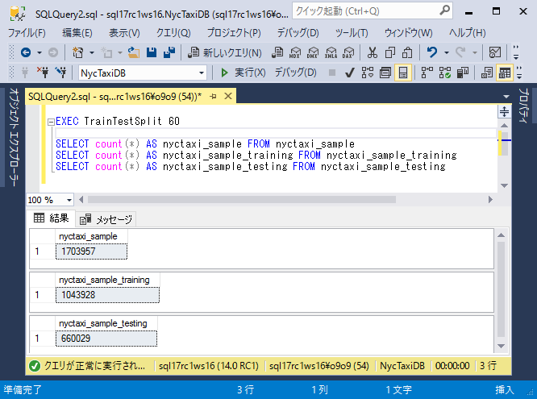
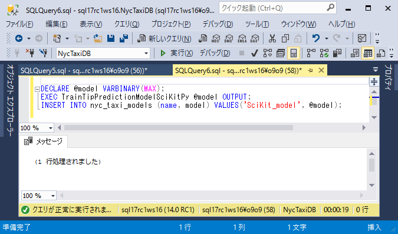
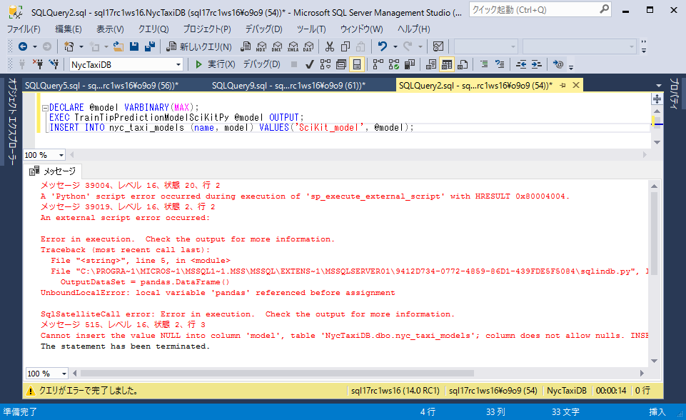
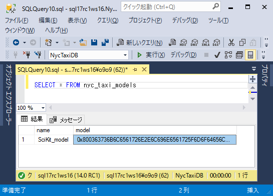
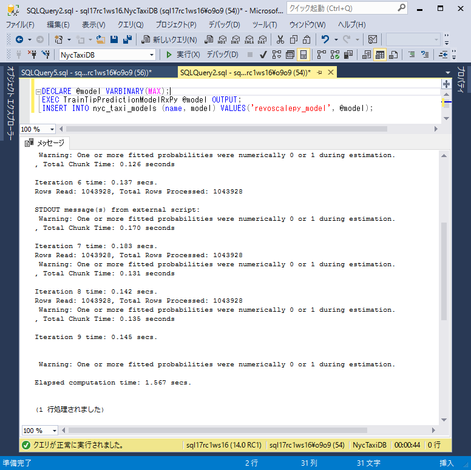
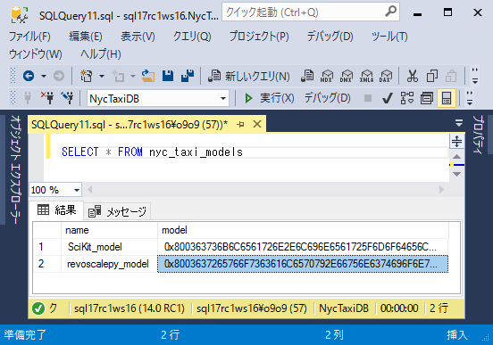

# Step 5: T-SQLを使用したモデルのトレーニングと保存

このステップでは、Pythonパッケージであるscikit-learnとrevoscalepyを使用して、機械学習モデルをトレーニングする方法を学習します。これらのPythonパッケージは既にSQL Server Machine Learning Servicesと共にインストールされているため、モジュールをロードしてストアドプロシージャ内から必要な関数を呼び出すことができます。作成したデータ特徴を使用してモデルをトレーニングし、訓練されたモデルをSQL Serverのテーブルに保存します。

## サンプルデータをトレーニングセットとテストセットに分割する

1.  ストアドプロシージャ`TrainTestSplit`は[Step 2: PowerShellを使用したSQL Serverへのデータインポート](sqldev-py2-import-data-to-sql-server-using-powershell.md)を通じてSQL Serverに定義されています。

    Management Studioのオブジェクトエクスプローラで、[プログラミング]、[ストアドプロシージャ]の順に展開します。`TrainTestSplit`を右クリックし、[変更] を選択して新しいクエリウィンドウでTransact-SQLスクリプトを開きます。

    `TrainTestSplit`はnyctaxi_sampleテーブルのデータをnyctaxi_sample_trainingとnyctaxi_sample_testingの2つのテーブルに分割します。

    ```SQL:TrainTestSplit
    CREATE PROCEDURE [dbo].[TrainTestSplit] (@pct int)
    AS
    
    DROP TABLE IF EXISTS dbo.nyctaxi_sample_training
    SELECT * into nyctaxi_sample_training FROM nyctaxi_sample WHERE (ABS(CAST(BINARY_CHECKSUM(medallion,hack_license)  as int)) % 100) < @pct
    
    DROP TABLE IF EXISTS dbo.nyctaxi_sample_testing
    SELECT * into nyctaxi_sample_testing FROM nyctaxi_sample
    WHERE (ABS(CAST(BINARY_CHECKSUM(medallion,hack_license)  as int)) % 100) > @pct
    GO
    ```

2. ストアドプロシージャを実行し、トレーニングセットに割り当てる割合を表す整数を入力します。たとえば、次の文は、トレーニングセットにデータの60％を割り当てます。トレーニングとテストのデータは、2つの別々のテーブルに格納されます。

    ```SQLT-SQL
    EXEC TrainTestSplit 60
    GO
    ```
    
    

## scikit-learnを使ってロジスティック回帰モデルを構築する

このセクションでは、作成したトレーニングデータを使用してモデルをトレーニングするストアドプロシージャを作成します。このストアドプロシージャは入力データを定義し、ロジスティック回帰モデルをトレーニングするためにscikit-learn関数を使用します。これはシステムストアドプロシージャsp_execute_external_scriptを使用して、SQL ServerとともにインストールされたPythonランタイムを呼び出すことで実装しています。

新しいトレーニングデータをパラメータとして定義しシステムストアドプロシージャsp_execute_exernal_scriptの呼び出しをラップするストアドプロシージャを作成することで、モデルの再トレーニングを容易にしています。

1.  ストアドプロシージャ`TrainTipPredictionModelSciKitPy`は[Step 2: PowerShellを使用したSQL Serverへのデータインポート](sqldev-py2-import-data-to-sql-server-using-powershell.md)を通じてSQL Serverに定義されています。

    Management Studioのオブジェクトエクスプローラで、[プログラミング]、[ストアドプロシージャ]の順に展開します。`TrainTipPredictionModelSciKitPy`を右クリックし、[変更] を選択して新しいクエリウィンドウでTransact-SQLスクリプトを開きます。

    ```SQL:TrainTipPredictionModelSciKitPy
    DROP PROCEDURE IF EXISTS TrainTipPredictionModelSciKitPy;
    GO
    
    CREATE PROCEDURE [dbo].[TrainTipPredictionModelSciKitPy] (@trained_model varbinary(max) OUTPUT)
    AS
    BEGIN
      EXEC sp_execute_external_script
      @language = N'Python',
      @script = N'
    import numpy
    import pickle
    # import pandas
    from sklearn.linear_model import LogisticRegression
    
    ##Create SciKit-Learn logistic regression model
    X = InputDataSet[["passenger_count", "trip_distance", "trip_time_in_secs", "direct_distance"]]
    y = numpy.ravel(InputDataSet[["tipped"]])
    
    SKLalgo = LogisticRegression()
    logitObj = SKLalgo.fit(X, y)
    
    ##Serialize model
    trained_model = pickle.dumps(logitObj)
    ',
      @input_data_1 = N'
      select tipped, fare_amount, passenger_count, trip_time_in_secs, trip_distance, 
      dbo.fnCalculateDistance(pickup_latitude, pickup_longitude,  dropoff_latitude, dropoff_longitude) as direct_distance
      from nyctaxi_sample_training
      ',
      @input_data_1_name = N'InputDataSet',
      @params = N'@trained_model varbinary(max) OUTPUT',
      @trained_model = @trained_model OUTPUT;
      ;
    END;
    GO
    ```

2. 次のSQL文を実行して、トレーニングされたモデルをnyc_taxi_modelsテーブルに登録します。

    ```SQL:T-SQL
    DECLARE @model VARBINARY(MAX);
    EXEC TrainTipPredictionModelSciKitPy @model OUTPUT;
    INSERT INTO nyc_taxi_models (name, model) VALUES('SciKit_model', @model);
    ```

    データ処理とモデルのフィッティングには数分かかります。Pythonのstdoutストリームにパイプされるメッセージは、Management Studioのメッセージウィンドウに表示されます。
    
    
    
    

3. nyc_taxi_modelsテーブルに新しいレコードが1つ追加され、シリアライズされたモデルが登録されていることを確認します。

    

## revoscalepyパッケージを使用してロジスティックモデルを構築する

次に、新しいリリースとなるRevoScalePyパッケージを使用したストアドプロシージャによってロジスティック回帰モデルをトレーニングします。Python のRevoScalePyパッケージには、RのRevoScaleRパッケージで提供されるものと同様のオブジェクト定義やデータ加工処理、機械学習のためのアルゴリズムが含まれています。このライブラリによって、ロジスティックや線形回帰、デシジョンツリーなどの一般的なアルゴリズムを使用した予測モデルのトレーニングや、計算コンテキストの作成、計算コンテキスト間のデータ移動、データ加工処理ができます。RevoScalePyの詳細は[Introducing RevoScalePy](https://docs.microsoft.com/ja-jp/sql/advanced-analytics/python/what-is-revoscalepy)を確認してください。

1.  ストアドプロシージャ`TrainTipPredictionModelRxPy`は[Step 2: PowerShellを使用したSQL Serverへのデータインポート](sqldev-py2-import-data-to-sql-server-using-powershell.md)を通じてSQL Serverに定義されています。

    Management Studioのオブジェクトエクスプローラで、[プログラミング]、[ストアドプロシージャ]の順に展開します。`TrainTipPredictionModelRxPy`を右クリックし、[変更] を選択して新しいクエリウィンドウでTransact-SQLスクリプトを開きます。

    ```SQL:TrainTipPredictionModelRxPy
    DROP PROCEDURE IF EXISTS TrainTipPredictionModelRxPy;
    GO
    
    CREATE PROCEDURE [dbo].[TrainTipPredictionModelRxPy] (@trained_model varbinary(max) OUTPUT)
    AS
    BEGIN
    EXEC sp_execute_external_script 
      @language = N'Python',
      @script = N'
    import numpy
    import pickle
    # import pandas
    from revoscalepy.functions.RxLogit import rx_logit
    
    ## Create a logistic regression model using rx_logit function from revoscalepy package
    logitObj = rx_logit("tipped ~ passenger_count + trip_distance + trip_time_in_secs + direct_distance", data = InputDataSet);
    
    ## Serialize model
    trained_model = pickle.dumps(logitObj)
    ',
    @input_data_1 = N'
    select tipped, fare_amount, passenger_count, trip_time_in_secs, trip_distance, 
    dbo.fnCalculateDistance(pickup_latitude, pickup_longitude,  dropoff_latitude, dropoff_longitude) as direct_distance
    from nyctaxi_sample_training
    ',
    @input_data_1_name = N'InputDataSet',
    @params = N'@trained_model varbinary(max) OUTPUT',
    @trained_model = @trained_model OUTPUT;
    ;
    END;
    GO
    ```

- nyctaxi_sample_trainingデータにrevoscalepyパッケージを使用してロジスティック回帰モデルをトレーニングします。
- SELECTクエリはカスタムスカラ関数fnCalculateDistanceを使用して、乗車位置と降車位置の間の直接距離を計算します。クエリの結果はデフォルトのPython入力変数`InputDataset`に格納されます。
- Pythonスクリプトは、Machine Learning Servicesに含まれているrevoscalepyのLogisticRegression関数を呼び出して、ロジスティック回帰モデルを作成します。
- tippedを目的変数に、passenger_count、trip_distance、trip_time_in_secs、およびdirect_distanceを説明変数としてモデルを作成します。    - Python変数`logitObj`で示される訓練済みモデルはシリアライズされ出力パラメータとして返ります。この出力をnyc_taxi_modelsテーブルに登録することで、将来の予測に繰り返し使用することができます。

2. 次のSQL文を実行して、トレーニングされたモデルをnyc_taxi_modelsテーブルに登録します。

    ```SQL:T-SQL
    DECLARE @model VARBINARY(MAX);
    EXEC TrainTipPredictionModelRxPy @model OUTPUT;
    INSERT INTO nyc_taxi_models (name, model) VALUES('revoscalepy_model', @model);
    ```

    データ処理とモデルのフィッティングには数分かかります。Pythonのstdoutストリームにパイプされるメッセージは、Management Studioのメッセージウィンドウに表示されます。

    
    
3. nyc_taxi_modelsテーブルに新しいレコードが1つ追加され、シリアライズされたモデルが登録されていることを確認します。

    
    
次のステップでは、訓練されたモデルを使用して予測を作成します。

## 次のステップ

[Step 6: モデルの利用](sqldev-py6-operationalize-the-model.md)

## 前のステップ

[Step 4: T-SQLを使用したデータの特徴抽出](sqldev-py4-create-data-features-using-t-sql.md)

## はじめから

[SQL開発者のための In-Database Python 分析](sqldev-in-database-python-for-sql-developers.md)

## 関連項目

[Machine Learning Services with Python](https://docs.microsoft.com/en-us/sql/advanced-analytics/python/sql-server-python-services)

<!--
---
title: "Step 5: Train and Save a Model using T-SQL | Microsoft Docs"
ms.custom: ""
ms.date: "07/26/2017"
ms.prod: "sql-server-2017"
ms.reviewer: ""
ms.suite: ""
ms.technology: 
  - "python-services"
ms.tgt_pltfrm: ""
ms.topic: "article"
applies_to: 
  - "SQL Server 2017"
dev_langs: 
  - "Python"
  - "TSQL"
ms.assetid: 
caps.latest.revision: 2
author: "jeannt"
ms.author: "jeannt"
manager: "jhubbard"
---
# Step 5: Train and save a model using T-SQL

In this step, you learn how to train a machine learning model using the Python packages **scikit-learn** and **revoscalepy**. These Python libraries are already installed with SQL Server Machine Learning Services, so you can load the modules and call the necessary functions from within a stored procedure. You'll train the model using the data features you just created, and then save the trained model in a [!INCLUDE[ssNoVersion](../../includes/ssnoversion-md.md)] table.

## Split the sample data into training and testing sets

1. Run the following T-SQL commands to create a stored procedure that divides the data in the nyctaxi\_sample table into two parts: nyctaxi\_sample\_training and nyctaxi\_sample\_testing.

    ```SQL
    CREATE PROCEDURE [dbo].[TrainTestSplit] (@pct int)
    AS
    
    DROP TABLE IF EXISTS dbo.nyctaxi_sample_training
    SELECT * into nyctaxi_sample_training FROM nyctaxi_sample WHERE (ABS(CAST(BINARY_CHECKSUM(medallion,hack_license)  as int)) % 100) < @pct
    
    DROP TABLE IF EXISTS dbo.nyctaxi_sample_testing
    SELECT * into nyctaxi_sample_testing FROM nyctaxi_sample
    WHERE (ABS(CAST(BINARY_CHECKSUM(medallion,hack_license)  as int)) % 100) > @pct
    GO
    ```

2. Run the stored procedure, and type an integer that represents the percentage of data allocated to the training set. For example, the following statement would allocate 60% of data to the training set. Training and testing data are stored in two separate tables.

    ```SQL
    EXEC TrainTestSplit 60
    GO
    ```

## Build a logistic regression model using scikit-learn

In this section, you create a stored procedure that can be used to train a model using the training data you just prepared. This stored procedure defines the input data and uses a **scikit-learn** function to train a logistic regression model. You call the Python runtime that is installed with SQL Server by using the system stored procedure, [sp_execute_external_script](../../relational-databases/system-stored-procedures/sp-execute-external-script-transact-sql.md).

To make it easier to retrain the model, you can wrap the call to sp_execute_exernal_script in another stored procedure, and pass in the new training data as a parameter. This section will walk you through that process.

1.  In [!INCLUDE[ssManStudio](../../includes/ssmanstudio-md.md)], open a new **Query** window and run the following statement to create the stored procedure _TrainTipPredictionModelSciKitPy_.  Note that the stored procedure contains a definition of the input data, so you don't need to provide an input query.

    ```SQL
    DROP PROCEDURE IF EXISTS TrainTipPredictionModelSciKitPy;
    GO

    CREATE PROCEDURE [dbo].[TrainTipPredictionModelSciKitPy] (@trained_model varbinary(max) OUTPUT)
    AS
    BEGIN
      EXEC sp_execute_external_script
      @language = N'Python',
      @script = N'
      import numpy
      import pickle
      import pandas
      from sklearn.linear_model import LogisticRegression
      
      ##Create SciKit-Learn logistic regression model
      X = InputDataSet[["passenger_count", "trip_distance", "trip_time_in_secs", "direct_distance"]]
      y = numpy.ravel(InputDataSet[["tipped"]])
      
      SKLalgo = LogisticRegression()
      logitObj = SKLalgo.fit(X, y)
      
      ##Serialize model
      trained_model = pickle.dumps(logitObj)
      ',
      @input_data_1 = N'
      select tipped, fare_amount, passenger_count, trip_time_in_secs, trip_distance, 
      dbo.fnCalculateDistance(pickup_latitude, pickup_longitude,  dropoff_latitude, dropoff_longitude) as direct_distance
      from nyctaxi_sample_training
      ',
      @input_data_1_name = N'InputDataSet',
      @params = N'@trained_model varbinary(max) OUTPUT',
      @trained_model = @trained_model OUTPUT;
      ;
    END;
    GO
    ```

2. Run the following SQL statements to insert the trained model into table nyc\_taxi_models.

    ```SQL
    DECLARE @model VARBINARY(MAX);
    EXEC TrainTipPredictionModelSciKitPy @model OUTPUT;
    INSERT INTO nyc_taxi_models (name, model) VALUES('SciKit_model', @model);
    ```

    Processing of the data and fitting the model might take a couple of mins. Messages that would be piped to Python's **stdout** stream are displayed in the **Messages** window of [!INCLUDE[ssManStudio](../../includes/ssmanstudio-md.md)]. For example:

    *STDOUT message(s) from external script:*
  *C:\Program Files\Microsoft SQL Server\MSSQL14.MSSQLSERVER\PYTHON_SERVICES\lib\site-packages\revoscalepy*

3. Open the table *nyc\_taxi_models*. You can see that one new row has been added, which contains the serialized model in the column _model_.

    *linear_model*
    *0x800363736B6C6561726E2E6C696E6561....*

## Build a logistic model using the _revoscalepy_ package

Now, create a different stored procedure that uses the new **revoscalepy** package to train a logistic regression model. The **revoscalepy** package for Python contains objects, transformation, and algorithms similar to those provided for the R language's **RevoScaleR** package. With this library, you can create a compute context, move data between compute contexts, transform data, and train predictive models using popular algorithms such as logistic and linear regression, decision trees, and more. For more information, see [what is revoscalepy?](../python/what-is-revoscalepy.md)

1. In [!INCLUDE[ssManStudio](../../includes/ssmanstudio-md.md)], open a new **Query** window and run the following statement to create the stored procedure _TrainTipPredictionModelRxPy_.  This model also uses the training data you just prepared. Because the stored procedure already includes a definition of the input data, you don't need to provide an input query.

    ```SQL
    DROP PROCEDURE IF EXISTS TrainTipPredictionModelRxPy;
    GO

    CREATE PROCEDURE [dbo].[TrainTipPredictionModelRxPy] (@trained_model varbinary(max) OUTPUT)
    AS
    BEGIN
    EXEC sp_execute_external_script 
      @language = N'Python',
      @script = N'
    import numpy
    import pickle
    import pandas
    from revoscalepy.functions.RxLogit import rx_logit_ex
    
    ## Create a logistic regression model using rx_logit_ex function from revoscalepy package
    logitObj = rx_logit_ex("tipped ~ passenger_count + trip_distance + trip_time_in_secs + direct_distance", data = InputDataSet);
    
    ## Serialize model
    trained_model = pickle.dumps(logitObj)
    ',
    @input_data_1 = N'
    select tipped, fare_amount, passenger_count, trip_time_in_secs, trip_distance, 
    dbo.fnCalculateDistance(pickup_latitude, pickup_longitude,  dropoff_latitude, dropoff_longitude) as direct_distance
    from nyctaxi_sample_training
    ',
    @input_data_1_name = N'InputDataSet',
    @params = N'@trained_model varbinary(max) OUTPUT',
    @trained_model = @trained_model OUTPUT;
    ;
    END;
    GO
    ```

    This stored procedure performs the following steps as part of model training:

    - Train a logistic regression model using revoscalepy package on nyctaxi\_sample\_training data.
    - The SELECT query uses the custom scalar function _fnCalculateDistance_ to calculate the direct distance between the pick-up and drop-off locations. The results of the query are stored in the default Python input variable, `InputDataset`.
    - The Python script calls the revoscalepy's LogisticRegression function, which is included with [!INCLUDE[rsql_productname](../../includes/rsql-productname-md.md)], to create the logistic regression model.
    - The binary variable _tipped_ is used as the *label* or outcome column,  and the model is fit using these feature columns:  _passenger_count_, _trip_distance_, _trip_time_in_secs_, and _direct_distance_.
    - The trained model, contained in the Python variable `logitObj`, is serialized and put as an output parameter [!INCLUDE[ssNoVersion](../../includes/ssnoversion-md.md)]. That output is inserted into the database table _nyc_taxi_models_, along with its name, as a new row, so that you can retrieve and use it for future predictions.

2. Run the stored procedure as follows to insert the trained **revoscalepy** model into the table _nyc\_taxi\_models.

    ```SQL
    DECLARE @model VARBINARY(MAX);
    EXEC TrainTipPredictionModelRxPy @model OUTPUT;
    
    INSERT INTO nyc_taxi_models (name, model) VALUES('revoscalepy_model', @model);
    ```

    Processing of the data and fitting the model might take a while. Messages that would be piped to Python's **stdout** stream are displayed in the **Messages** window of [!INCLUDE[ssManStudio](../../includes/ssmanstudio-md.md)]. For example:

    *STDOUT message(s) from external script:*
  *C:\Program Files\Microsoft SQL Server\MSSQL14.MSSQLSERVER\PYTHON_SERVICES\lib\site-packages\revoscalepy*

3. Open the table *nyc_taxi_models*. You can see that one new row has been added, which contains the serialized model in the column _model_.

    *rx_model*
    *0x8003637265766F7363616c....*

In the next step, you use the trained models to create predictions.

## Next step

[Step 6: Operationalize the model](sqldev-py6-operationalize-the-model.md)

## Previous step

[Step 4: Create data features using T-SQL](sqldev-py5-train-and-save-a-model-using-t-sql.md)

-->