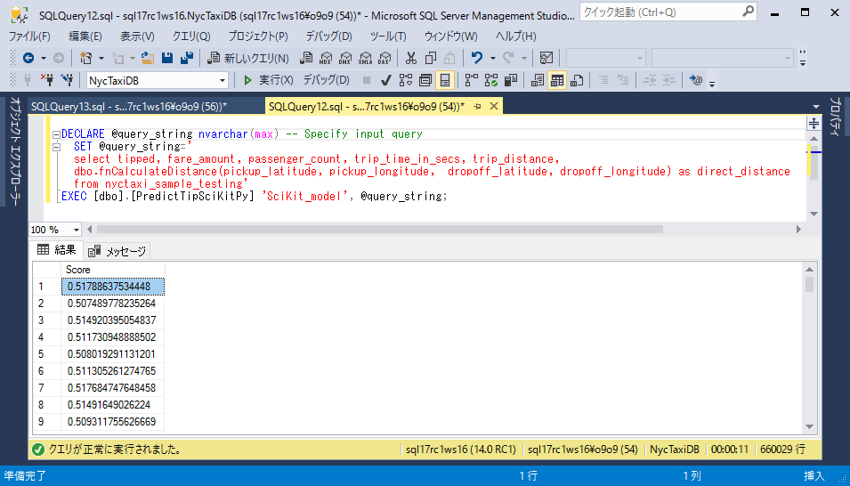
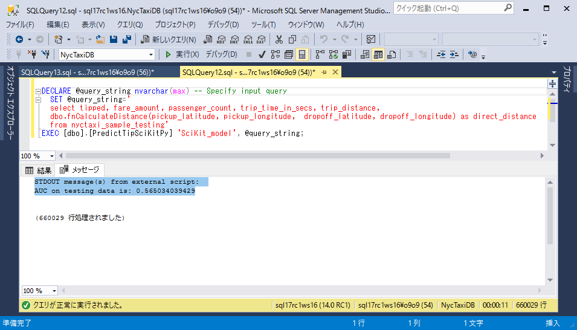
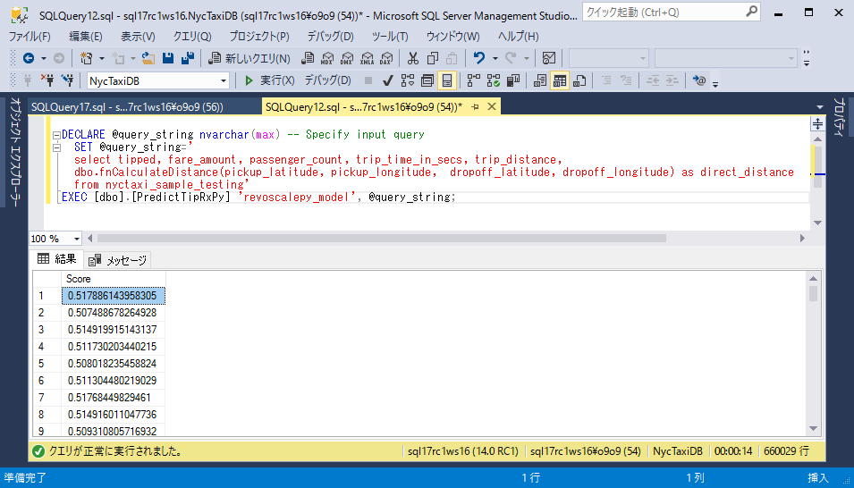
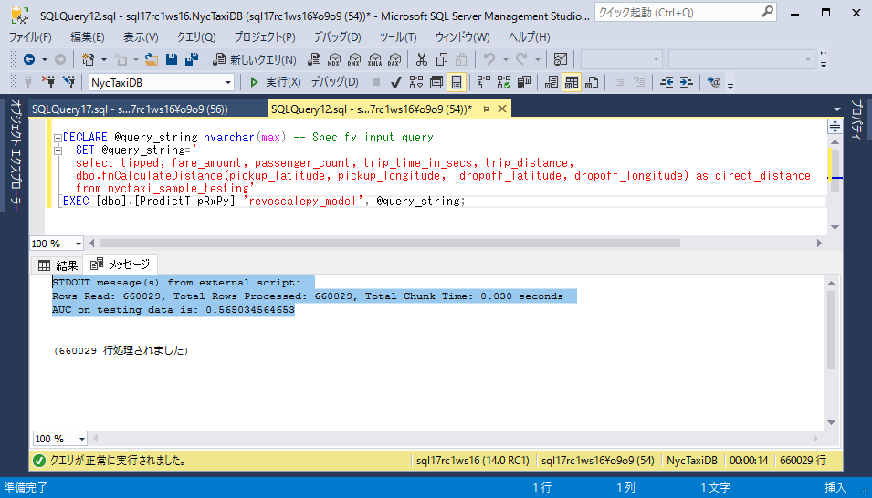
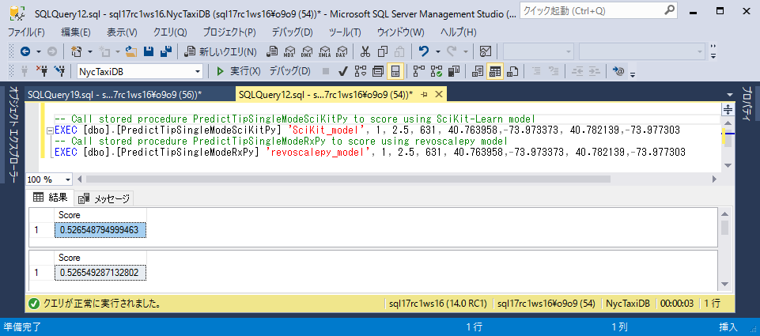

# Step 6: モデルの利用

このステップでは、前の手順で訓練したモデルを利用する方法を学びます。ここでの"利用"とは、「スコアリングのためにモデルを本番環境に展開する」ことを意味しています。これはPythonコードがストアドプロシージャに含まれているために簡単に展開できます。アプリケーションから新しい観測値の予測を行うためにはストアドプロシージャを呼び出すだけです。

ストアドプロシージャからPythonモデルを呼び出すには、次の2つの方法があります。

- **バッチスコアリングモード**：複数の行のデータを提供するためにSELECTクエリを使用します。ストアドプロシージャは入力に対応する観測値のテーブルを戻します
- **個々のスコアリングモード**：個々のパラメータ値のセットを入力として渡します。ストアドプロシージャは単一のレコードまたは値を返します。

## scikit-learnモデルを使用したスコアリング

ストアドプロシージャ`PredictTipSciKitPy`は、scikit-learnモデルを使用します。`PredictTipSciKitPy`はストアドプロシージャ内からPython予測呼び出しをラップするための基本的な構文を示しています。

- 使用するモデル名をストアドプロシージャの入力パラメータで指定されます。
- 指定されたモデル名を元にnyc_taxi_modelsテーブルからシリアライズされたモデルが取り出されます。
- シリアライズされたモデルはPython変数`mod`に格納されます。
- スコアリングした新しいケースは`@input_data_1`で指定されたTransact-SQLクエリから取得されます。このクエリ結果はデフォルトのデータフレーム`InputDataSet`に保存されます。
- このデータフレームはscikit-learnモデルを使用して作成されたロジスティック回帰モデル`mod`の関数`predict_proba`に渡されます。
- 関数`predict_proba`は任意の額のチップを受け取る確率を示すfloat値を戻します。
- さらに、精度メトリック`AUC(area under curve)`を計算します。AUCなどの精度メトリックは説明変数に加えて目的変数（すなわちtipped列）も指定した場合にのみ生成されます。予測には目的変数（変数Y）を必要としませんが、精度メトリックの計算には必要です。したがって、スコアリングするデータに目的変数がない場合は、ソースコードからAUC計算ブロックを削除し、単純に説明変数(変数X)によってチップを受け取る確率を返すようにストアドプロシージャを変更することができます。

ストアドプロシージャ`PredictTipSciKitPy`は[Step 2: PowerShellを使用したSQL Serverへのデータインポート](sqldev-py2-import-data-to-sql-server-using-powershell.md)を通じてSQL Serverに定義されています。

Management Studioのオブジェクトエクスプローラで、[プログラミング]、[ストアドプロシージャ]の順に展開します。`PredictTipSciKitPy`を右クリックし、[変更] を選択して新しいクエリウィンドウでTransact-SQLスクリプトを開きます。

```SQL:PredictTipSciKitPy
DROP PROCEDURE IF EXISTS PredictTipSciKitPy;
GO

CREATE PROCEDURE [dbo].[PredictTipSciKitPy] (@model varchar(50), @inquery nvarchar(max))
AS
BEGIN
  DECLARE @lmodel2 varbinary(max) = (select model from nyc_taxi_models where name = @model);

  EXEC sp_execute_external_script 
	@language = N'Python',
    @script = N'
import pickle
import numpy
# import pandas
from sklearn import metrics

mod = pickle.loads(lmodel2)

X = InputDataSet[["passenger_count", "trip_distance", "trip_time_in_secs", "direct_distance"]]
y = numpy.ravel(InputDataSet[["tipped"]])

prob_array = mod.predict_proba(X)
prob_list = [item[1] for item in prob_array]

prob_array = numpy.asarray(prob_list)
fpr, tpr, thresholds = metrics.roc_curve(y, prob_array)
auc_result = metrics.auc(fpr, tpr)
print("AUC on testing data is:", auc_result)

OutputDataSet = pandas.DataFrame(data=prob_list, columns=["predictions"])
',	
	@input_data_1 = @inquery,
	@input_data_1_name = N'InputDataSet',
	@params = N'@lmodel2 varbinary(max)',
	@lmodel2 = @lmodel2
  WITH RESULT SETS ((Score float));

END
GO
```

## revoscalepyモデルを使用したスコアリング

ストアドプロシージャ`PredictTipRxPy`は、revoscalepyライブラリを使用して作成されたモデルを使用します。これはプロシージャ`PredictTipSciKitPy`とほぼ同じように機能しますが、revoscalepy関数にはいくつかの変更が加えられています。

ストアドプロシージャ`PredictTipRxPy`は[Step 2: PowerShellを使用したSQL Serverへのデータインポート](sqldev-py2-import-data-to-sql-server-using-powershell.md)を通じてSQL Serverに定義されています。

Management Studioのオブジェクトエクスプローラで、[プログラミング]、[ストアドプロシージャ]の順に展開します。`PredictTipRxPy`を右クリックし、[変更] を選択して新しいクエリウィンドウでTransact-SQLスクリプトを開きます。

```SQL:PredictTipRxPy
DROP PROCEDURE IF EXISTS PredictTipRxPy;
GO

CREATE PROCEDURE [dbo].[PredictTipRxPy] (@model varchar(50), @inquery nvarchar(max))
AS
BEGIN
  DECLARE @lmodel2 varbinary(max) = (select model from nyc_taxi_models where name = @model);

  EXEC sp_execute_external_script 
	@language = N'Python',
    @script = N'
import pickle
import numpy
# import pandas
from sklearn import metrics
from revoscalepy.functions.RxPredict import rx_predict

mod = pickle.loads(lmodel2)
X = InputDataSet[["passenger_count", "trip_distance", "trip_time_in_secs", "direct_distance"]]
y = numpy.ravel(InputDataSet[["tipped"]])

prob_array = rx_predict(mod, X)
prob_list = prob_array["tipped_Pred"].values

prob_array = numpy.asarray(prob_list)
fpr, tpr, thresholds = metrics.roc_curve(y, prob_array)
auc_result = metrics.auc(fpr, tpr)
print("AUC on testing data is:", auc_result)
OutputDataSet = pandas.DataFrame(data=prob_list, columns=["predictions"])
',	
	@input_data_1 = @inquery,
	@input_data_1_name = N'InputDataSet',
	@params = N'@lmodel2 varbinary(max)',
	@lmodel2 = @lmodel2
  WITH RESULT SETS ((Score float));

END
GO
```

## バッチスコアリングの実行

ストアドプロシージャ`PredictTipSciKitPy`および`PredictTipRxPy`には、2つの入力パラメータが必要です。

- スコアリング対象とするデータを抽出するクエリ
- スコアリングに使用する訓練済みモデルの識別子

このセクションでは、これらの引数をストアドプロシージャに渡して、スコアリングに使用するモデルとデータの両方を簡単に変更する方法を学習します。

1. 入力データを定義し、次のようにスコアリングのためにストアドプロシージャを呼び出します。この例では、スコアリングにストアドプロシージャ`PredictTipSciKitPy`を使用し、モデルの名前とクエリ文字列を渡します

    ```SQL:T-SQL
    DECLARE @query_string nvarchar(max) -- Specify input query
      SET @query_string='
      select tipped, fare_amount, passenger_count, trip_time_in_secs, trip_distance,
      dbo.fnCalculateDistance(pickup_latitude, pickup_longitude,  dropoff_latitude, dropoff_longitude) as direct_distance
      from nyctaxi_sample_testing'
    EXEC [dbo].[PredictTipSciKitPy] 'SciKit_model', @query_string;
    ```
    
    
    

    ストアドプロシージャは、入力クエリの一部として渡された各運転記録に対してのチップを受け取る確率の予測値を返します。予測値はManagement Studioの結果ペインに表示されます。またメッセージペインには精度メトリック`AUC（曲線下面積）`が出力されます。
    
2. revoscalepyモデルをスコアリングに使用するには、ストアドプロシージャPredictTipRxPyを呼び出します。

    ```SQL
    DECLARE @query_string nvarchar(max) -- Specify input query
      SET @query_string='
      select tipped, fare_amount, passenger_count, trip_time_in_secs, trip_distance,
      dbo.fnCalculateDistance(pickup_latitude, pickup_longitude,  dropoff_latitude, dropoff_longitude) as direct_distance
      from nyctaxi_sample_testing'
    EXEC [dbo].[PredictTipRxPy] 'revoscalepy_model', @query_string;
    ```

    
    
    
## 個々のスコアリングの実行

バッチスコアリングの代わりに、単一のケースを渡し、その値に基づいた単一の結果を得たいケースもあります。たとえば、Excelワークシート、Webアプリケーション、またはReporting Servicesレポートにおいてユーザからの入力に基づいてストアドプロシージャを呼び出すよう構成します。

このセクションでは、ストアドプロシージャ`PredictTipSingleModeSciKitPy or PredictTipSingleModeRxPy`を呼び出して単一の予測を作成する方法を学習します。

1. ストアドプロシージャ`PredictTipSingleModeSciKitPy or PredictTipSingleModeRxPy`は[Step 2: PowerShellを使用したSQL Serverへのデータインポート](sqldev-py2-import-data-to-sql-server-using-powershell.md)を通じてSQL Serverに定義されています。

    Management Studioのオブジェクトエクスプローラで、[プログラミング]、[ストアドプロシージャ]の順に展開します。`PredictTipSingleModeSciKitPy or PredictTipSingleModeRxPy`を右クリックし、[変更] を選択して新しいクエリウィンドウでTransact-SQLスクリプトを開きます。
    
    これらのストアドプロシージャは、scikit-learnおよびrevoscalepyモデルを使用し、次のようにスコアリングを実行します。

  - モデルの名前と複数の単一値が入力として提供されます。これらの入力には、客数、運転距離などが含まれます。
  - テーブル値関数`fnEngineerFeatures`は緯度と経度を入力で受け取り直接距離に変換します。
  - 外部アプリケーションからストアドプロシージャを呼び出す場合は、入力データがPythonモデルの必要な入力機能と一致することを確認してください。これには、入力データをPythonデータ型にキャストすることやデータ型、データ長を検証することが含まれます。
  - ストアドプロシージャは、格納されているPythonモデルに基づいてスコアを作成します。

### PredictTipSingleModeSciKitPy

以下はscikit-learnモデルを使用してスコアリングを実行するストアドプロシージャ`PredictTipSingleModeSciKitPy`です。

```SQL:PredictTipSingleModeSciKitPy
CREATE PROCEDURE [dbo].[PredictTipSingleModeSciKitPy] (@model varchar(50), @passenger_count int = 0,
@trip_distance float = 0,
@trip_time_in_secs int = 0,
@pickup_latitude float = 0,
@pickup_longitude float = 0,
@dropoff_latitude float = 0,
@dropoff_longitude float = 0)
AS
BEGIN
    DECLARE @inquery nvarchar(max) = N'
    SELECT * FROM [dbo].[fnEngineerFeatures]( 
    @passenger_count,
    @trip_distance,
    @trip_time_in_secs,
    @pickup_latitude,
    @pickup_longitude,
    @dropoff_latitude,
    @dropoff_longitude)
    '
    DECLARE @lmodel2 varbinary(max) = (select model from nyc_taxi_models where name = @model);
    EXEC sp_execute_external_script 
        @language = N'Python',
        @script = N'
import pickle
import numpy
# import pandas

# Load model and unserialize
mod = pickle.loads(model)

# Get features for scoring from input data
X = InputDataSet[["passenger_count", "trip_distance", "trip_time_in_secs", "direct_distance"]]

# Score data to get tip prediction probability as a list (of float)
prob = [mod.predict_proba(X)[0][1]]

# Create output data frame
OutputDataSet = pandas.DataFrame(data=prob, columns=["predictions"])
',
    @input_data_1 = @inquery,
    @params = N'@model varbinary(max),@passenger_count int,@trip_distance float,
        @trip_time_in_secs int ,
        @pickup_latitude float ,
        @pickup_longitude float ,
        @dropoff_latitude float ,
        @dropoff_longitude float',
    @model = @lmodel2,
        @passenger_count =@passenger_count ,
        @trip_distance=@trip_distance,
        @trip_time_in_secs=@trip_time_in_secs,
        @pickup_latitude=@pickup_latitude,
        @pickup_longitude=@pickup_longitude,
        @dropoff_latitude=@dropoff_latitude,
        @dropoff_longitude=@dropoff_longitude
    WITH RESULT SETS ((Score float));
END
GO
```

### PredictTipSingleModeRxPy

以下はrevoscalepyモデルを使用してスコアリングを実行するストアドプロシージャ`PredictTipSingleModeRxPy`です。

```SQL
CREATE PROCEDURE [dbo].[PredictTipSingleModeRxPy] (@model varchar(50), @passenger_count int = 0,
@trip_distance float = 0,
@trip_time_in_secs int = 0,
@pickup_latitude float = 0,
@pickup_longitude float = 0,
@dropoff_latitude float = 0,
@dropoff_longitude float = 0)
AS
BEGIN
    DECLARE @inquery nvarchar(max) = N'
    SELECT * FROM [dbo].[fnEngineerFeatures]( 
    @passenger_count,
    @trip_distance,
    @trip_time_in_secs,
    @pickup_latitude,
    @pickup_longitude,
    @dropoff_latitude,
    @dropoff_longitude)
    '
    DECLARE @lmodel2 varbinary(max) = (select model from nyc_taxi_models where name = @model);
    EXEC sp_execute_external_script 
        @language = N'Python',
        @script = N'
import pickle
import numpy
# import pandas
from revoscalepy.functions.RxPredict import rx_predict

# Load model and unserialize
mod = pickle.loads(model)

# Get features for scoring from input data
x = InputDataSet[["passenger_count", "trip_distance", "trip_time_in_secs", "direct_distance"]]

# Score data to get tip prediction probability as a list (of float)

prob_array = rx_predict(mod, x)

prob_list = prob_array["tipped_Pred"].values

# Create output data frame
OutputDataSet = pandas.DataFrame(data=prob_list, columns=["predictions"])
',
    @input_data_1 = @inquery,
    @params = N'@model varbinary(max),@passenger_count int,@trip_distance float,
        @trip_time_in_secs int ,
        @pickup_latitude float ,
        @pickup_longitude float ,
        @dropoff_latitude float ,
        @dropoff_longitude float',
    @model = @lmodel2,
        @passenger_count =@passenger_count ,
        @trip_distance=@trip_distance,
        @trip_time_in_secs=@trip_time_in_secs,
        @pickup_latitude=@pickup_latitude,
        @pickup_longitude=@pickup_longitude,
        @dropoff_latitude=@dropoff_latitude,
        @dropoff_longitude=@dropoff_longitude
    WITH RESULT SETS ((Score float));
END
GO
```

2.  Management Studioで新しいクエリウィンドウを開き、説明変数列を入力してストアドプロシージャを呼び出します。

    ```SQL
    -- Call stored procedure PredictTipSingleModeSciKitPy to score using SciKit-Learn model
    EXEC [dbo].[PredictTipSingleModeSciKitPy] 'SciKit_model', 1, 2.5, 631, 40.763958,-73.973373, 40.782139,-73.977303
    -- Call stored procedure PredictTipSingleModeRxPy to score using revoscalepy model
    EXEC [dbo].[PredictTipSingleModeRxPy] 'revoscalepy_model', 1, 2.5, 631, 40.763958,-73.973373, 40.782139,-73.977303
    ```
    
    7つの説明変数値は以下の順序です。
    
    -   passenger_count
    -   trip_distance
    -   trip_time_in_secs
    -   pickup_latitude
    -   pickup_longitude
    -   dropoff_latitude
    -   dropoff_longitude

    結果として上記のパラメータを有する運転においてチップが支払われる確率が返されます。
    
    
    
## まとめ

このチュートリアルでは、ストアドプロシージャに埋め込まれたPythonコードを操作する方法を学びました。Transact-SQLとの統合により、予測のためのPythonモデルのデプロイメントやエンタープライズデータワークフローの一部としてのモデル再トレーニングの組み込みがさらに簡単になることを確認しました。

## 前のステップ

[Step 5: T-SQLを使用したモデルのトレーニングと保存](sqldev-py5-train-and-save-a-model-using-t-sql.md)

## はじめから

[SQL開発者のための In-Database Python 分析](sqldev-in-database-python-for-sql-developers.md)

## 関連項目

[Machine Learning Services with Python](https://docs.microsoft.com/en-us/sql/advanced-analytics/python/sql-server-python-services)

<!--
---
title: "Step 6: Operationalize the Model| Microsoft Docs"
ms.custom: ""
ms.date: "05/25/2017"
ms.prod: "sql-server-2017"
ms.reviewer: ""
ms.suite: ""
ms.technology: 
  - "python-services"
ms.tgt_pltfrm: ""
ms.topic: "article"
applies_to: 
  - "SQL Server 2017"
dev_langs: 
  - "Python"
  - "TSQL"
ms.assetid: 
caps.latest.revision: 2
author: "jeannt"
ms.author: "jeannt"
manager: "jhubbard"
---
# Step 6: Operationalize the Model

In this step, you'll learn to *operationalize* the models that you trained and saved in the previous step. Operationalize in this case means "deploying the model to production for scoring". This is easy to do if your Python code is contained in a stored procedure. You can then call the stored procedure from applications, to make predictions on new observations.

You'll learn two methods for calling a Python model from a stored procedure:

- **Batch scoring mode**: Use a SELECT query to provide multiple rows of data. The stored procedure returns a table of observations corresponding to the input cases.
- **Individual scoring mode**: Pass a set of individual parameter values as input.  The stored procedure returns a single row or value.

## Scoring using the scikit-learn model

The stored procedure _PredictTipSciKitPy_ uses the scikit-learn model. This stored procedure illustrates the basic syntax for wrapping a Python prediction call in a stored procedure.

- The name of the model to use is provided as input parameter to the stored procedure. 
- The stored procedure will then load the serialized  model from the database table `nyc_taxi_models`.table, using the SELECT statement in the stored procedure.
- The serialized model is stored in the Python variable `mod` for further processing using Python.
- The new cases that need to be scored are obtained from the [!INCLUDE[tsql](../../includes/tsql-md.md)] query specified in `@input_data_1`. As the query data is read, the rows are saved in the default data frame, `InputDataSet`.
- This data frame is passed to the `predict_proba` function of the logistic regression model, `mod`, which was created by using scikit-learn model. 
- The `predict_proba` function (`probArray = mod.predict_proba(X)`) returns a **float** that represents the probability that a tip (of any amount) will be given.
- The stored procedure also calculates an accuracy metric, AUC (area under curve). Accuracy metrics such as AUC can only be generated if you also provide the target label (i.e. the tipped column). Predictions do not need the target label (variable `y`), but the accuracy metric calculation does.

  Therefore, if you don't have target labels for the data to be scored, you can modify the stored procedure to remove the AUC calculations, and simply return the tip probabilities from the features (variable `X` in the stored procedure).

```SQL
CREATE PROCEDURE [dbo].[PredictTipSciKitPy] (@model varchar(50), @inquery nvarchar(max))
AS
BEGIN
  DECLARE @lmodel2 varbinary(max) = (select model from nyc_taxi_models where name = @model);
  EXEC sp_execute_external_script
    @language = N'Python',
    @script = N'
        import pickle;
        import numpy;
        import pandas;
        from sklearn import metrics
        
        mod = pickle.loads(lmodel2)
        
        X = InputDataSet[["passenger_count", "trip_distance", "trip_time_in_secs", "direct_distance"]]
        y = numpy.ravel(InputDataSet[["tipped"]])
        
        probArray = mod.predict_proba(X)
        probList = []
        for i in range(len(probArray)):
          probList.append((probArray[i])[1])
        
        probArray = numpy.asarray(probList)
        fpr, tpr, thresholds = metrics.roc_curve(y, probArray)
        aucResult = metrics.auc(fpr, tpr)
        print ("AUC on testing data is: " + str(aucResult))
        
        OutputDataSet = pandas.DataFrame(data = probList, columns = ["predictions"])
        ',	
    @input_data_1 = @inquery,
    @input_data_1_name = N'InputDataSet',
    @params = N'@lmodel2 varbinary(max)',
    @lmodel2 = @lmodel2
  WITH RESULT SETS ((Score float));
END
GO
```

## Scoring using the revoscalepy model

The stored procedure _PredictTipRxPy_ uses a model that was created using the **revoscalepy** library. It works much the same way as the _PredictTipSciKitPy_ procedure, but with some changes for the **revoscalepy** functions.

```SQL
CREATE PROCEDURE [dbo].[PredictTipRxPy] (@model varchar(50), @inquery nvarchar(max))
AS
BEGIN
  DECLARE @lmodel2 varbinary(max) = (select model from nyc_taxi_models2 where name = @model);
  
  EXEC sp_execute_external_script 
    @language = N'Python',
    @script = N'
      import pickle;
      import numpy;
      import pandas;
      from sklearn import metrics
      from revoscalepy.functions.RxPredict import rx_predict_ex;
      
      mod = pickle.loads(lmodel2)
      X = InputDataSet[["passenger_count", "trip_distance", "trip_time_in_secs", "direct_distance"]]
      y = numpy.ravel(InputDataSet[["tipped"]])
      
      probArray = rx_predict_ex(mod, X)
      probList = []
      for i in range(len(probArray._results["tipped_Pred"])):
        probList.append((probArray._results["tipped_Pred"][i]))
      
      probArray = numpy.asarray(probList)
      fpr, tpr, thresholds = metrics.roc_curve(y, probArray)
      aucResult = metrics.auc(fpr, tpr)
      print ("AUC on testing data is: " + str(aucResult))
      OutputDataSet = pandas.DataFrame(data = probList, columns = ["predictions"])
      ',	
    @input_data_1 = @inquery,
    @input_data_1_name = N'InputDataSet',
    @params = N'@lmodel2 varbinary(max)',
    @lmodel2 = @lmodel2
  WITH RESULT SETS ((Score float));
END
GO
```

## Batch scoring using a SELECT query

The stored procedures **PredictTipSciKitPy** and **PredictTipRxPy** require two input parameters: 

- The query that retrieves the data for scoring
- The name of a trained model

In this section you'll learn how to pass those arguments to the stored procedure to easily change both the model and the data used for scoring.

1. Define the input data and call the stored procedures for scoring as follows. This example uses the stored procedure PredictTipSciKitPy for scoring, and passes in the model's name and query string

    ```SQL
    DECLARE @query_string nvarchar(max) -- Specify input query
      SET @query_string='
      select tipped, fare_amount, passenger_count, trip_time_in_secs, trip_distance,
      dbo.fnCalculateDistance(pickup_latitude, pickup_longitude,  dropoff_latitude, dropoff_longitude) as direct_distance
      from nyctaxi_sample_testing'
    EXEC [dbo].[PredictTipSciKitPy] 'SciKit_model', @query_string;
    ```

    The stored procedure returns predicted probabilities for each trip that was passed in as part of the input query. If you are using SSMS (SQL Server Management Studio) for running queries, the probabilities will appear as a table in the **Results** pane. The **Messages** pane outputs the accuracy metric (AUC or area under curve) with a value of around 0.56.

2. To use the **revoscalepy** model for scoring, call the stored procedure **PredictTipRxPy**, passing in the model name and query string.

    ```SQL
    EXEC [dbo].[PredictTipRxPy] 'revoscalepy_model', @query_string;
    ```

## Score Individual Rows using scikit-learn model

Sometimes, instead of batch scoring, you might want to pass in a single case, getting values from an application, and get a single result based on those values. For example, you could set up an Excel worksheet, web application, or Reporting Services report to call the stored procedure and provide inputs typed or selected by users.

In this section, you'll learn how to create single predictions by calling a stored procedure.

1. Take a minute to review the code of the stored procedures [PredictTipSingleModeSciKitPy](#PredictTipSingleModeSciKitPy) and [PredictTipSingleModeRxPy](#PredictTipSingleModeRxPy), which are included as part of the download. These stored procedures use the scikit-learn and revoscalepy models, and perform scoring as follows:

  - The model's name and multiple single values are provided as input. These inputs include passenger count, trip distance, and so forth.
  - A table-valued function, `fnEngineerFeatures`, takes input values and converts the latitudes and longitudes to direct distance. [Lesson 4](sqldev-py4-create-data-features-using-t-sql.md) contains a description of this table-valued function.
  - If you call the stored procedure from an external application, ensure that the input data matches the required input features of the Python model. This might include casting or converting the input data to a Python data type, or validating data type and data length.
  - The stored procedure creates a score based on the stored Python model.

### PredictTipSingleModeSciKitPy

Here is the definition of the stored procedure that performs scoring using the **scikit-learn** model.

```SQL
CREATE PROCEDURE [dbo].[PredictTipSingleModeSciKitPy] (@model varchar(50), @passenger_count int = 0,
  @trip_distance float = 0,
  @trip_time_in_secs int = 0,
  @pickup_latitude float = 0,
  @pickup_longitude float = 0,
  @dropoff_latitude float = 0,
  @dropoff_longitude float = 0)
AS
BEGIN
  DECLARE @inquery nvarchar(max) = N'
  SELECT * FROM [dbo].[fnEngineerFeatures]( 
    @passenger_count,
    @trip_distance,
    @trip_time_in_secs,
    @pickup_latitude,
    @pickup_longitude,
    @dropoff_latitude,
    @dropoff_longitude)
    '
  DECLARE @lmodel2 varbinary(max) = (select model from nyc_taxi_models2 where name = @model);
  EXEC sp_execute_external_script 
    @language = N'Python',
    @script = N'
      import pickle;
      import numpy;
      import pandas;
      
      # Load model and unserialize
      mod = pickle.loads(model)
      
      # Get features for scoring from input data
      X = InputDataSet[["passenger_count", "trip_distance", "trip_time_in_secs", "direct_distance"]]
      
      # Score data to get tip prediction probability as a list (of float)
      probList = []
      probList.append((mod.predict_proba(X)[0])[1])
      
      # Create output data frame
      OutputDataSet = pandas.DataFrame(data = probList, columns = ["predictions"])
    ',
    @input_data_1 = @inquery,
    @params = N'@model varbinary(max),@passenger_count int,@trip_distance float,
      @trip_time_in_secs int ,
      @pickup_latitude float ,
      @pickup_longitude float ,
      @dropoff_latitude float ,
      @dropoff_longitude float',
      @model = @lmodel2,
      @passenger_count =@passenger_count ,
      @trip_distance=@trip_distance,
      @trip_time_in_secs=@trip_time_in_secs,
      @pickup_latitude=@pickup_latitude,
      @pickup_longitude=@pickup_longitude,
      @dropoff_latitude=@dropoff_latitude,
      @dropoff_longitude=@dropoff_longitude
  WITH RESULT SETS ((Score float));
END
GO
```

### PredictTipSingleModeRxPy

Here is the definition of the stored procedure that performs scoring using the **revoscalepy** model.

```SQL
CREATE PROCEDURE [dbo].[PredictTipSingleModeRxPy] (@model varchar(50), @passenger_count int = 0,
  @trip_distance float = 0,
  @trip_time_in_secs int = 0,
  @pickup_latitude float = 0,
  @pickup_longitude float = 0,
  @dropoff_latitude float = 0,
  @dropoff_longitude float = 0)
AS
BEGIN
  DECLARE @inquery nvarchar(max) = N'
    SELECT * FROM [dbo].[fnEngineerFeatures]( 
      @passenger_count,
      @trip_distance,
      @trip_time_in_secs,
      @pickup_latitude,
      @pickup_longitude,
      @dropoff_latitude,
      @dropoff_longitude)
    '
  DECLARE @lmodel2 varbinary(max) = (select model from nyc_taxi_models2 where name = @model);
  EXEC sp_execute_external_script 
    @language = N'Python',
    @script = N'
      import pickle;
      import numpy;
      import pandas;
      from revoscalepy.functions.RxPredict import rx_predict_ex;
      
      # Load model and unserialize
      mod = pickle.loads(model)
      
      # Get features for scoring from input data
      X = InputDataSet[["passenger_count", "trip_distance", "trip_time_in_secs", "direct_distance"]]
      
      # Score data to get tip prediction probability as a list (of float)
      
      probArray = rx_predict_ex(mod, X)
      
      probList = []
      probList.append(probArray._results["tipped_Pred"])
      
      # Create output data frame
      OutputDataSet = pandas.DataFrame(data = probList, columns = ["predictions"])
      ',
    @input_data_1 = @inquery,
    @params = N'@model varbinary(max),@passenger_count int,@trip_distance float,
      @trip_time_in_secs int ,
      @pickup_latitude float ,
      @pickup_longitude float ,
      @dropoff_latitude float ,
      @dropoff_longitude float',
      @model = @lmodel2,
      @passenger_count =@passenger_count ,
      @trip_distance=@trip_distance,
      @trip_time_in_secs=@trip_time_in_secs,
      @pickup_latitude=@pickup_latitude,
      @pickup_longitude=@pickup_longitude,
      @dropoff_latitude=@dropoff_latitude,
      @dropoff_longitude=@dropoff_longitude
  WITH RESULT SETS ((Score float));
END
GO
```

2.  To try it out, open a new **Query** window, and call the stored procedure, typing parameters for each of the feature columns.

    ```SQL
	-- Call stored procedure PredictTipSingleModeSciKitPy to score using SciKit-Learn model
	EXEC [dbo].[PredictTipSingleModeSciKitPy] 'linear_model', 1, 2.5, 631, 40.763958,-73.973373, 40.782139,-73.977303
	-- Call stored procedure PredictTipSingleModeRxPy to score using revoscalepy model
	EXEC [dbo].[PredictTipSingleModeRxPy] 'revoscalepy_model', 1, 2.5, 631, 40.763958,-73.973373, 40.782139,-73.977303
    ```
    
    The seven values are for these feature columns, in order:
    
    -   *passenger_count*
    -   *trip_distance*
    -   *trip_time_in_secs*
    -   *pickup_latitude*
    -   *pickup_longitude*
    -   *dropoff_latitude*
    -   *dropoff_longitude*

3. The output from both procedures is a probability of a tip being paid for the taxi trip with the above parameters or features.

## Conclusions

In this tutorial, you've learned how to work with Python code embedded in stored procedures. The integration with [!INCLUDE[tsql](../../includes/tsql-md.md)] makes it much easier to deploy Python models for prediction and to incorporate model retraining as part of an enterprise data workflow.

## Previous Step
[Step 6: Operationalize the Model](sqldev-py6-operationalize-the-model.md)

## See Also

[Machine Learning Services with Python](../python/sql-server-python-services.md)
-->
